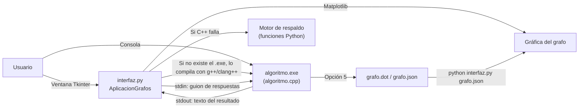
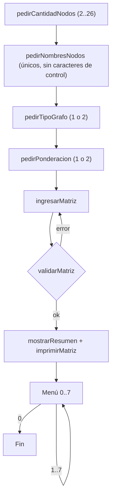
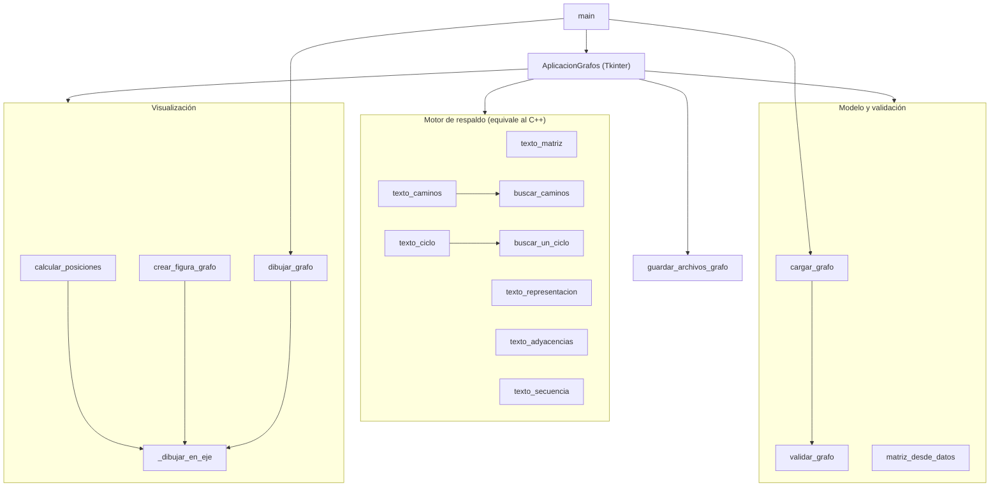
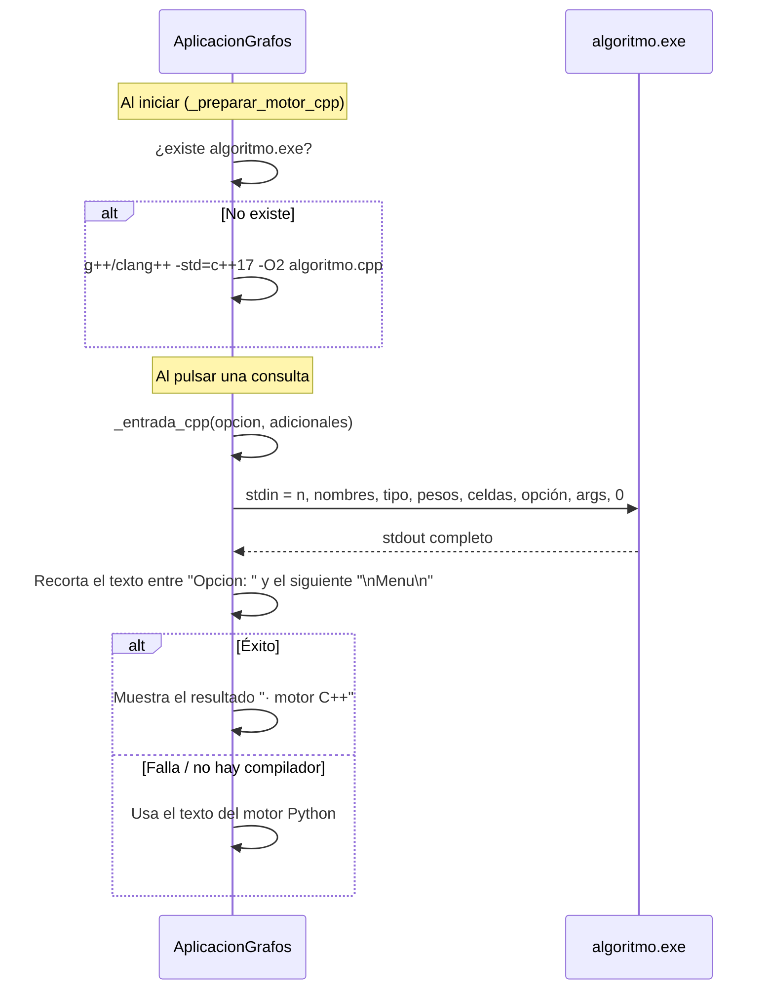

# Laboratorio 3 · Teoría de Grafos (C++ + Python)

Documentación técnica del proyecto. Se basa solo en los tres archivos centrales:

| Archivo | Rol |
|---|---|
| [`algoritmo.cpp`](algoritmo.cpp) | **Motor de cálculo**. Programa de consola en C++17 que construye, valida y analiza el grafo. |
| [`interfaz.py`](interfaz.py) | **Interfaz gráfica** (Tkinter + Matplotlib). Usa el motor C++ y tiene un **motor de respaldo** en Python. También sirve como visor de grafos desde la línea de comandos. |
| [`requirements.txt`](requirements.txt) | Dependencia externa de Python: `matplotlib>=3.8`. |

---

## 1. ¿Qué hace el proyecto?

Permite **definir un grafo con su matriz de adyacencia** y luego hacer consultas típicas de teoría de grafos:

1. Mostrar la **matriz de adyacencia**.
2. Mostrar la **representación formal** `G = (V, E)` o `G = (V, A)`.
3. Consultar los **adyacentes de un nodo** (o sucesores/predecesores) y su **grado**.
4. Verificar si una **secuencia de nodos** es un camino, un camino simple o un ciclo, y calcular su costo.
5. **Exportar** el grafo a `grafo.dot` (Graphviz) y `grafo.json`.
6. Buscar **todos los caminos simples** entre dos nodos (o todos los ciclos simples si origen = destino).
7. **Detectar automáticamente** si el grafo tiene un ciclo.
8. **Dibujar** el grafo (solo desde Python, con Matplotlib).

### Tipos de grafo admitidos

| Dimensión | Opciones |
|---|---|
| Dirección | No dirigido · Dirigido |
| Pesos | No ponderado (`0/1`) · Ponderado (números reales) |
| Tamaño | De **2 a 26** nodos |
| Restricción | **Grafo simple**: sin lazos ni aristas repetidas |

> En un grafo ponderado, `x` significa **sin conexión** y `0` es una **arista que cuesta cero**. Los pesos deben ser finitos y estar en el rango `[-1e9, 1e9]`.

---

## 2. Arquitectura general



Hay **tres formas de usarlo**:

| Modo | Comando | Qué pasa |
|---|---|---|
| Consola C++ | `g++ -std=c++17 -O2 algoritmo.cpp -o algoritmo` y luego `./algoritmo` | Menú interactivo en la terminal. |
| Interfaz gráfica | `python interfaz.py` | Abre la ventana completa. |
| Visor de JSON | `python interfaz.py grafo.json [--guardar img.png] [--sin-mostrar]` | Dibuja un grafo exportado; puede guardarlo como PNG/SVG/PDF. |

---

## 3. El motor en C++ (`algoritmo.cpp`)

### 3.1 Estructuras de datos

```cpp
enum class TipoGrafo { NoDirigido = 1, Dirigido = 2 };

struct Conexion {
    int existe = 0;     // 0 = no hay arista, 1 = hay arista
    double peso = 0;    // peso de la arista (1 en grafos no ponderados)
};
```

- El grafo se guarda como una **matriz de adyacencia** `vector<vector<Conexion>>` de tamaño `n × n`.
- Los nombres de los nodos se guardan en `vector<string>`; **el índice del vector es el identificador interno** del nodo.
- Separar `existe` de `peso` permite tener **aristas de peso 0** sin confundirlas con "no hay arista".

### 3.2 Flujo de `main`



### 3.3 Entrada y validación robusta

| Función | Qué hace |
|---|---|
| `leerLinea` | Lee una línea completa. Si se acaba la entrada (EOF), cierra el programa. Esto evita bucles infinitos cuando la GUI le pasa datos por `stdin`. |
| `leerEnteroEnRango` | Lee un entero y rechaza texto sobrante (`"3abc"` no es válido) o valores fuera de rango. |
| `pedirNombreNodo` | Quita espacios al inicio y al final, y rechaza nombres vacíos o con caracteres de control. |
| `interpretarPeso` | Usa `stod` y exige que **se consuma toda la cadena** y que el peso sea válido (`pesoValido`). |
| `pedirValorAdyacencia` / `pedirConexion` | Piden cada celda. Si hay un lazo en la diagonal, lo rechazan y vuelven a preguntar. |

**`ingresarMatriz`**
- **Dirigido**: pide las `n²` celdas.
- **No dirigido**: pide solo el **triángulo superior con la diagonal** (`j ≥ i`) y copia cada valor en `matriz[j][i]`. Así la simetría se cumple al construir la matriz.

**`validarMatriz`** revisa, en este orden:
1. Que `n` esté entre 2 y 26 y coincida con la cantidad de nombres.
2. Que el tipo de grafo sea válido.
3. Que todas las filas tengan longitud `n`.
4. Que cada celda sea consistente: `existe ∈ {0,1}`, el peso sea finito, una ausencia tenga peso 0 y una arista no ponderada tenga peso 1.
5. Que no haya lazos en la diagonal.
6. Si el grafo no es dirigido, que la matriz sea **simétrica** en `existe` y en `peso`.

Si falla, explica el error con los nombres de los nodos y vuelve a pedir la matriz.

### 3.4 Operaciones del menú

#### (1) Matriz de adyacencia — `imprimirMatriz`
Calcula un ancho de columna según el nombre o valor más largo y lo alinea con `setw`. En grafos ponderados muestra `x` para las ausencias.

#### (2) Representación matemática — `mostrarRepresentacionMatematica`

| Grafo | Formato de cada arista |
|---|---|
| No dirigido, no ponderado | `{"A","B"}` |
| No dirigido, ponderado | `("A","B",peso)` |
| Dirigido, no ponderado | `<"A","B">` |
| Dirigido, ponderado | `<"A","B",peso>` |

En grafos no dirigidos solo recorre `j > i`, así cada arista aparece una vez. Los nombres se escriben con `std::quoted`.

#### (3) Adyacentes y grado — `mostrarAdyacentes`
- **No dirigido**: recorre la fila `i` y cuenta los vecinos. Grado = número de vecinos.
- **Dirigido**: la fila `i` da los **sucesores** (grado de salida) y la columna `i` da los **predecesores** (grado de entrada).
- Si no tiene ninguna conexión, avisa que es un **nodo aislado**.

#### (4) Verificar una secuencia — `analizarSecuencia`

| Predicado | Definición implementada |
|---|---|
| `esCamino` | Existe una arista entre cada par de nodos seguidos. |
| `esCaminoSimple` | No se repiten nodos (se permite que el último sea igual al primero). Usa `set<int>`. |
| `esCiclo` | Tiene al menos 3 elementos, el primero es igual al último y es un camino. En grafos **no dirigidos** además exige que **no se repita ninguna arista** (`tieneAristasDiferentes` usa pares `(min,max)`). Así `A-B-A` no cuenta como ciclo. |

La **longitud** es el número de aristas (`tamaño − 1`). En grafos ponderados también muestra el **costo total** (suma de pesos).

#### (5) Exportar — `generarArchivoDOT` + `generarArchivoDatos`
- **`grafo.dot`**: usa `graph` o `digraph` según el tipo, con `rankdir=LR` y nodos circulares. Los nodos se llaman `n0, n1, …` y el nombre real va en `label`. Así cualquier nombre (con espacios, comillas, etc.) produce un DOT válido.
- **`grafo.json`**: se escribe a mano. `escaparJSON` escapa las comillas, `\\` y los caracteres de control (`\uXXXX`). Formato:

```json
{
  "dirigido": false,
  "ponderado": true,
  "nodos": ["A", "B", "C"],
  "aristas": [
    {"origen": 0, "destino": 1, "peso": 2.5}
  ]
}
```

#### (6) Todos los caminos simples / ciclos — `buscarCaminosSimples`
Usa **backtracking (DFS con vuelta atrás)** y un vector `visitados`:

- **`explorarCaminosSimples`** (origen ≠ destino): avanza a cada vecino que no se haya visitado, lo marca, sigue con la recursión y luego lo desmarca. Cada vez que llega al destino, guarda el recorrido.
- **`explorarCiclosDesdeOrigen`** (origen = destino): igual, pero cuando un vecino es el **origen**, cierra el ciclo.
  - **Para no repetir ciclos** en grafos no dirigidos (`A→B→C→A` es el mismo ciclo que `A→C→B→A`), solo acepta la orientación en la que `recorrido[1] < recorrido.back()`.
  - Después confirma el ciclo con `esCiclo`.

Para cada resultado muestra el recorrido, la longitud y el costo (si el grafo es ponderado).

> [!WARNING]
> Enumerar todos los caminos simples tiene complejidad **exponencial** en el peor caso (del orden de `O(n!)` en un grafo completo). Con 26 nodos y muchas aristas puede tardar mucho.

#### (7) Detectar un ciclo — `buscarUnCiclo` / `buscarCicloDFS`
Es un **DFS con tres estados** (coloreado blanco/gris/negro):

| Estado | Significado |
|---|---|
| `0` | Sin visitar |
| `1` | En la pila de recursión actual |
| `2` | Terminado |

- Si encuentra una arista hacia un nodo en estado `1`, hay una **arista de retroceso**, es decir, un ciclo. El ciclo se reconstruye con la `pila` desde ese nodo hasta el actual.
- En grafos **no dirigidos** no se cuenta la arista hacia el **padre**, porque si no cada arista parecería un ciclo de longitud 2.
- Lanza el DFS desde cada nodo no visitado para cubrir **todas las componentes**.
- Complejidad: `O(n²)`, porque con matriz de adyacencia hay que revisar toda la fila de cada nodo.

---

## 4. La interfaz en Python (`interfaz.py`)

### 4.1 Organización del archivo



### 4.2 Modelo de datos en Python
Se usan **dos representaciones**:
- **`datos`** (dict): el mismo formato que `grafo.json`, es decir `dirigido`, `ponderado`, `nodos` y `aristas`.
- **`matriz`** (lista de listas): `None` = sin arista; un número = peso (o `1` si no es ponderado). La genera `matriz_desde_datos`, que en grafos no dirigidos llena las dos mitades.

**`validar_grafo`** repite en Python las reglas del C++: tipos booleanos, de 2 a 26 nodos, nombres únicos y no vacíos, índices válidos, sin lazos, sin aristas repetidas (en no dirigidos `(a,b)` y `(b,a)` son la misma), y pesos finitos dentro del límite solo cuando el grafo es ponderado.

### 4.3 Clase `AplicacionGrafos` (GUI)

Distribución de la ventana: un `PanedWindow` horizontal que se abre maximizada en Windows.

| Panel | Contenido |
|---|---|
| **1. Configuración** | Número de nodos (Spinbox 2–26), tipo (Combobox), casilla *Ponderado* y botón *Crear / reiniciar matriz*. |
| **2. Nodos y matriz** | Una fila de `Entry` para los nombres y una cuadrícula `n×n` de `Entry` dentro de un `Canvas` con barras de desplazamiento. |
| **3. Consultas** | Adyacentes, origen/destino para buscar caminos y un constructor de secuencias (*Agregar / Quitar último / Limpiar / Verificar*). |
| Botones | Mostrar matriz · Representación formal · Detectar ciclos · Visualizar grafo · Exportar JSON/DOT · Limpiar resultados. |
| Pestañas | **Resultados** (`Text` con fuente Consolas) y **Gráfica** (Matplotlib integrado con su barra de herramientas). |

Detalles de cómo está hecha la matriz (`_crear_matriz_visual`):
- La **diagonal** está deshabilitada y siempre vale `0` o `x`.
- En grafos **no dirigidos**, la celda `[fila][col]` del triángulo inferior **usa la misma `StringVar`** que la celda `[col][fila]` y es de solo lectura. Así **la simetría se mantiene sola**: escribir arriba actualiza abajo.
- Al cambiar un nombre (`trace_add`), se actualizan los encabezados de fila y columna.
- Cualquier cambio después de validar llama a `_marcar_pendiente`, que borra el grafo construido y pide validar otra vez. Así nunca se hacen consultas sobre datos viejos.

**`_construir_grafo`** lee los nombres y las celdas, convierte los textos (`0/1` o `float`/`x`), arma `datos` y `matriz`, y pasa todo por `validar_grafo`. Si algo falla, muestra un `messagebox` con el error.

### 4.4 Integración con C++ (la parte clave)



1. **`_preparar_motor_cpp`**: si `algoritmo.exe` no existe, busca `g++` o `clang++` con `shutil.which` y compila (`timeout=90`, sin abrir consola en Windows).
2. **`_entrada_cpp`** arma un **guion de respuestas** con el mismo orden de preguntas del programa C++: cantidad, nombres, tipo (`1/2`), ponderación (`1/2`), las celdas en el orden de `ingresarMatriz` (triángulo superior con diagonal si no es dirigido), la opción del menú, sus argumentos y al final `0` para salir.
3. **`_ejecutar_cpp`** corre el ejecutable con `subprocess.run` (`timeout=20`) y **recorta la salida**: busca el primer `"\nMenu\n"`, toma el texto después del `"Opcion: "` siguiente y corta en el próximo `"\nMenu\n"`. Así queda solo el resultado de la operación pedida.
4. **`_resultado_operacion`**: si el C++ devuelve algo, lo muestra con la etiqueta `· motor C++`. Si no, usa el texto que calculó el motor Python.

| Botón | Opción C++ | Argumentos enviados | Respaldo Python |
|---|---|---|---|
| Mostrar matriz | 1 | — | `texto_matriz` |
| Representación formal | 2 | — | `texto_representacion` |
| Consultar adyacentes | 3 | nombre | `texto_adyacencias` |
| Verificar secuencia | 4 | longitud + nombres | `texto_secuencia` |
| Buscar todos los caminos | 6 | origen, destino | `texto_caminos` |
| Detectar ciclos | 7 | — | `texto_ciclo` |
| Exportar JSON/DOT | — | *(lo hace Python)* | `guardar_archivos_grafo` |
| Visualizar grafo | — | *(lo hace Python)* | `crear_figura_grafo` |

### 4.5 Motor de respaldo (Python)
Repite los algoritmos del C++:
- `es_camino`, `es_camino_simple` y `es_ciclo`: la misma lógica; en no dirigidos revisa que no se repitan aristas con `tuple(sorted(...))`.
- `buscar_caminos`: backtracking. En ciclos no dirigidos **quita duplicados después de buscar**: compara cada ciclo con su versión invertida (`min(tuple(ciclo), tuple(reverso))`). El C++ en cambio los descarta durante la búsqueda.
- `buscar_un_ciclo`: el mismo DFS de 3 estados, con un diccionario `posicion` para recortar la pila en `O(1)`.

> [!NOTE]
> Hay una pequeña diferencia: en grafos **dirigidos**, el motor C++ acepta ciclos de 2 nodos (`A→B→A`) cuando se busca con origen = destino. El respaldo Python pide `len(recorrido) >= 3`, así que **no** los muestra.

### 4.6 Visualización (Matplotlib)
- **`calcular_posiciones`**: pone los nodos sobre una **circunferencia unitaria**, empezando arriba (`π/2`) y en sentido horario. Con 2 nodos los pone en horizontal.
- **`_dibujar_en_eje`**:
  - Cada arista es un `FancyArrowPatch`: con flecha `-|>` si es dirigido y una línea `-` si no.
  - Si hay **aristas opuestas** (`A→B` y `B→A`), las curva en sentidos contrarios (`arc3,rad=±0.17`) para que no se tapen.
  - `shrinkA/shrinkB` depende del largo del nombre, para que la flecha termine en el borde de la etiqueta.
  - Los pesos se ponen en el punto medio, un poco desplazados en dirección perpendicular a la arista.
  - El tamaño de la fuente y de la figura cambia según la cantidad de nodos.
- `crear_figura_grafo` usa `matplotlib.figure.Figure` (sin `pyplot`) para meter la figura en Tkinter con `FigureCanvasTkAgg`. `dibujar_grafo` usa `pyplot` para el modo de línea de comandos.

### 4.7 Punto de entrada (`main`)
Usa `argparse`:
- Sin argumentos: `iniciar_interfaz()`. Si Tkinter no está o no hay pantalla, muestra un error claro.
- Con `archivo.json`: `cargar_grafo` → `dibujar_grafo`. Con `--guardar` exporta la imagen. `--sin-mostrar` solo es válido junto con `--guardar`.

---

## 5. Dependencias (`requirements.txt`)

```text
matplotlib>=3.8
```

- **Matplotlib** es la única dependencia externa (para dibujar).
- **Tkinter** viene con Python estándar (en algunas distribuciones de Linux hay que instalar `python3-tk`).
- Para el motor C++ hace falta un compilador compatible con **C++17** (`g++` o `clang++`). Es opcional: sin él, la GUI usa el motor Python.

```bash
pip install -r requirements.txt
python interfaz.py
```

---

## 6. Conceptos de teoría de grafos implementados

| Concepto | Dónde |
|---|---|
| Matriz de adyacencia | `ingresarMatriz`, `imprimirMatriz`, `matriz_desde_datos` |
| Grafo simple (sin lazos ni multiaristas) | `validarMatriz`, `validar_grafo` |
| Simetría en grafos no dirigidos | `validarMatriz`, `StringVar` compartida en la GUI |
| Notación `G=(V,E)` / `G=(V,A)` | `mostrarRepresentacionMatematica`, `texto_representacion` |
| Vecindad, grado, grado de entrada/salida, nodo aislado | `mostrarAdyacentes`, `texto_adyacencias` |
| Camino, camino simple, longitud, costo | `esCamino`, `esCaminoSimple`, `calcularCosto` |
| Ciclo (sin repetir aristas en no dirigidos) | `esCiclo`, `tieneAristasDiferentes` |
| Enumerar caminos y ciclos simples (backtracking) | `buscarCaminosSimples`, `buscar_caminos` |
| Detectar ciclos con DFS de 3 estados | `buscarCicloDFS`, `buscar_un_ciclo` |
| Exportar a Graphviz DOT / JSON | `generarArchivoDOT`, `generarArchivoDatos`, `guardar_archivos_grafo` |
