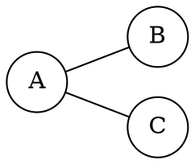

# Explicación completa - Laboratorio 3: Teoría de grafos

Actualizado hasta la parte 2 (HU-04 para grafos no ponderados), el 7 de octubre de 2026. El seguimiento de las próximas entregas está en [PLAN_INCREMENTAL.md](PLAN_INCREMENTAL.md). Las partes 1 y 2 están implementadas; su compilación y ejecución siguen pendientes en un entorno con compilador C++.

## 1. ¿Qué se desarrolló?

Se desarrolló un programa de consola en C++ que permite crear y analizar un grafo simple mediante una matriz de adyacencia.

El programa permite:

- Definir entre 2 y 26 nodos.
- Asignar un nombre diferente a cada nodo: letras, números, palabras o símbolos.
- Elegir entre un grafo dirigido y uno no dirigido.
- Ingresar las conexiones del grafo.
- Construir y mostrar su matriz de adyacencia.
- Mostrar la representación matemática del grafo.
- Consultar los nodos adyacentes.
- Comprobar si una secuencia de nodos es un camino.
- Comprobar si una secuencia forma un ciclo.
- Generar un archivo DOT para representar gráficamente el grafo con Graphviz.

El programa implementa solamente la Guía 3. No incluye rutas más cortas, Dijkstra, Bellman-Ford ni requisitos de la Guía 4.

## 2. Decisiones de diseño

### Programación procedural

El programa utiliza programación procedural: el problema se divide en funciones pequeñas, y cada función realiza una tarea específica.

Este enfoque se eligió porque:

- El programa administra un solo grafo durante cada ejecución.
- Las operaciones son pequeñas y fáciles de separar.
- Evita introducir clases que todavía no aportan una ventaja importante.
- Facilita explicar el código durante una sustentación.
- Mantiene el programa básico y entendible.

Utilizar POO también sería válido, pero no es necesario para cumplir el objetivo de esta práctica.

### Grafo simple y no ponderado

El programa trabaja con grafos simples y no ponderados:

- `0` significa que no existe una conexión.
- `1` significa que existe una conexión.
- No se permiten lazos de un nodo consigo mismo.
- La diagonal principal de la matriz permanece en cero.
- Las aristas no tienen costos ni pesos.

Los pesos todavía no se incluyen. Las historias HU-01, HU-03 y HU-05 los requieren: se incorporarán en la parte 3 del plan incremental, antes de implementar rutas mínimas.

### Límite de 26 nodos

Los nombres ya no están limitados al abecedario. Se conserva por ahora el máximo acordado de 26 nodos para la captura manual; el mínimo exigido por HU-02 es de dos.

Este límite también es razonable para una aplicación de consola. Una matriz de 26 nodos contiene 676 posiciones y una gráfica de ese tamaño puede ser difícil de leer.

## 3. Estructuras de datos principales

### Vector de nombres

```cpp
vector<string> nombresNodos;
```

Guarda el nombre completo de cada nodo, por ejemplo `a`, `v1`, `15`, `@` o `Nodo central`.

Por ejemplo:

```text
Índice:  0  1  2  3
Nodo:    A  B  C  D
```

El índice permite relacionar cada nombre con una fila y una columna de la matriz.

### Matriz de adyacencia

```cpp
vector<vector<int>> matrizAdyacencia;
```

La matriz es cuadrada. Tiene el mismo número de filas y columnas que de nodos.

Si `matriz[i][j]` contiene `1`, existe una conexión desde el nodo `i` hacia el nodo `j`.

Si contiene `0`, no existe esa conexión.

Ejemplo:

```text
      A  B  C
  A   0  1  1
  B   1  0  0
  C   1  0  0
```

Este ejemplo representa las aristas `A-B` y `A-C`.

### Tipo de grafo

```cpp
enum class TipoGrafo {
    NoDirigido = 1,
    Dirigido = 2
};
```

El `enum class` evita trabajar por todo el programa con números sin significado evidente.

Es más claro escribir:

```cpp
tipo == TipoGrafo::Dirigido
```

que escribir:

```cpp
tipo == 2
```

## 4. Flujo general del programa

El programa sigue este orden:

```text
Inicio
  |
  v
Pedir cantidad de nodos
  |
  v
Pedir nombres únicos
  |
  v
Elegir tipo de grafo
  |
  v
Ingresar conexiones
  |
  v
Validar matriz
  |
  v
Mostrar resumen y matriz
  |
  v
Ejecutar menú de operaciones
  |
  v
Salir
```

La matriz se crea una sola vez. Después, el menú permite realizar varias consultas sobre el mismo grafo sin volver a ingresarlo.

## 5. Explicación de las funciones

### `leerEnteroEnRango`

```cpp
int leerEnteroEnRango(const string& mensaje, int minimo, int maximo,
                     const string& mensajeMinimo = "");
```

Solicita un número entero y comprueba que esté dentro de un rango.

La entrada se recibe primero como una línea de texto y luego se analiza con `stringstream`. Esto permite rechazar correctamente casos como:

```text
hola
3abc
1 2
-5
100
```

El programa continúa preguntando hasta recibir un único entero válido. `mensajeMinimo` permite explicar específicamente por qué se rechaza una cantidad menor que dos. Si se acaba la entrada, `leerLinea` cierra el programa con código 1 para evitar un ciclo infinito.

Esta función se reutiliza para:

- Cantidad de nodos.
- Tipo de grafo.
- Valores de la matriz.
- Opciones del menú.
- Longitud de una secuencia.

### `leerLinea`

```cpp
string leerLinea(const string& mensaje);
```

Presenta un mensaje y recibe una línea completa, incluidos los espacios internos. Si falla la lectura o se cierra la entrada, informa el cierre y termina con código 1 mediante `exit(EXIT_FAILURE)`. Se centraliza esta comprobación para que las funciones que preguntan datos no se queden repitiendo mensajes.

### `nombreRepetido`

```cpp
bool nombreRepetido(const vector<string>& nombres, const string& nombre);
```

Compara el nombre con los ya registrados. La comparación es exacta: `A` y `a` son identificadores diferentes. Un duplicado se rechaza y se solicita otro nombre.

### `pedirNombreNodo`

```cpp
string pedirNombreNodo(const string& mensaje);
```

Recibe un nombre por línea. Quita espacios, tabulaciones y retornos de carro de los extremos mediante `find_first_not_of`, `find_last_not_of` y `substr`. Rechaza nombres vacíos y caracteres de control internos; conserva palabras, números, símbolos y espacios internos.

Ejemplos:

```text
a             -> válido; conserva la minúscula
AB            -> válido
15            -> válido
Nodo central  -> válido; es un solo nombre
@             -> válido
  v1          -> se guarda como v1
línea vacía   -> inválido
```

La modalidad es un nombre por línea: `A,B` representa un solo identificador, no dos nodos. Para consultarlo hay que escribir su nombre exacto; los espacios de los extremos se vuelven a quitar.

### `pedirCantidadNodos`

```cpp
int pedirCantidadNodos();
```

Utiliza `leerEnteroEnRango` para aceptar cantidades entre 2 y 26.

### `pedirNombresNodos`

```cpp
void pedirNombresNodos(vector<string>& nombres, int cantidad);
```

Solicita el nombre de cada nodo y evita nombres repetidos después de quitar los espacios de los extremos.

El vector se pasa por referencia porque la función debe modificarlo y agregar los nombres ingresados.

### `pedirTipoGrafo`

```cpp
TipoGrafo pedirTipoGrafo();
```

Presenta dos opciones:

```text
1. No dirigido
2. Dirigido
```

Luego transforma la opción numérica en un valor de `TipoGrafo`.

### `pedirValorAdyacencia`

```cpp
int pedirValorAdyacencia(const string& origen, const string& destino, TipoGrafo tipo);
```

Pregunta si existe una conexión entre dos nodos.

En un grafo no dirigido se muestra:

```text
Existe la arista 'A' -- 'B'? (0/1):
```

En un grafo dirigido se muestra:

```text
Existe la arista 'A' -> 'B'? (0/1):
```

Solamente acepta `0` o `1`. Si el origen y el destino son el mismo nodo, el valor `1` representa un lazo. El programa informa qué nodo tiene el lazo, explica que esta versión trabaja con grafos simples y vuelve a pedir esa celda hasta recibir `0`.

### `ingresarMatriz`

```cpp
void ingresarMatriz(
    vector<vector<int>>& matriz,
    const vector<string>& nombres,
    TipoGrafo tipo
);
```

Construye la matriz de adyacencia a partir de las conexiones indicadas por el usuario.

#### Grafo dirigido

En un grafo dirigido, `A -> B` no significa lo mismo que `B -> A`. Por lo tanto, se pregunta por cada dirección de manera independiente.

```text
Existe A -> B
Existe B -> A
```

Las dos respuestas pueden ser diferentes. Se recorren todas las celdas por filas, incluida la diagonal. Para dos nodos, el orden es `A-A`, `A-B`, `B-A`, `B-B`.

#### Grafo no dirigido

En un grafo no dirigido, `A -- B` es la misma arista que `B -- A`.

El programa pregunta una sola vez y copia el resultado en las dos posiciones:

```cpp
matriz[j][i] = matriz[i][j];
```

Así se garantiza automáticamente que la matriz sea simétrica.

Se pregunta también por la diagonal. En un grafo no dirigido se recorre el triángulo superior incluyéndola: para tres nodos, el orden es `A-A`, `A-B`, `A-C`, `B-B`, `B-C`, `C-C`. Los lazos se detectan, se informan y se rechazan; el usuario debe corregirlos a cero. Un error en esa celda no obliga a volver a ingresar los nombres ni las conexiones anteriores.

### `validarMatriz`

```cpp
bool validarMatriz(
    const vector<vector<int>>& matriz,
    const vector<string>& nombres,
    TipoGrafo tipo,
    string& error
);
```

Comprueba que:

- La matriz tenga de 2 a 26 filas.
- La cantidad de filas coincida con la cantidad de nombres.
- El tipo de grafo sea válido.
- Todas las filas estén completas y la matriz sea cuadrada.
- Todos los valores sean `0` o `1`.
- La diagonal principal esté en cero.
- Sea simétrica si el grafo es no dirigido.

Primero revisa el tamaño de **todas** las filas, antes de consultar cualquier celda. Esto evita leer fuera de los límites de un vector si una fila posterior está incompleta. Después revisa valores, diagonal y simetría.

Devuelve `true` si todo es correcto y deja `error` vacío. Si encuentra un problema, devuelve `false` y escribe una explicación en `error`, que se pasa por referencia. No imprime ni cambia la matriz: el `main` se encarga de mostrar el mensaje y pedir nuevamente la captura si falla la revisión final.

Ejemplos de mensajes:

```text
La fila de 'B' tiene 0 valores; se esperaban 2.
Valor invalido en ['A']['B']: 2. Solo se permite 0 o 1.
Se detecto un lazo en el nodo 'A'. La diagonal debe ser 0 en un grafo simple.
Inconsistencia: de 'A' a 'B' hay 1, pero de 'B' a 'A' hay 0. El grafo no dirigido debe ser simetrico.
```

La captura no dirigida mantiene la simetría automáticamente; la comprobación adicional permite rechazar una matriz inconsistente recibida de otra fuente en el futuro. Las pruebas unitarias construyen esas matrices inválidas directamente para verificarlo.

### `mostrarResumen`

```cpp
void mostrarResumen(
    const vector<string>& nombres,
    TipoGrafo tipo
);
```

Muestra la cantidad de nodos y si el grafo es dirigido o no dirigido.

### `imprimirMatriz`

```cpp
void imprimirMatriz(
    const vector<vector<int>>& matriz,
    const vector<string>& nombres
);
```

Imprime los nombres de los nodos como encabezados de filas y columnas.

`setw` usa un ancho calculado a partir del nombre más largo más dos espacios. Así caben nombres compuestos. El ancho se mide en bytes: algunos caracteres Unicode pueden verse desalineados según la terminal y su fuente.

### `mostrarRepresentacionMatematica`

```cpp
void mostrarRepresentacionMatematica(
    const vector<vector<int>>& matriz,
    const vector<string>& nombres,
    TipoGrafo tipo
);
```

Muestra el conjunto de vértices:

```text
V = {"A", "B", "C"}
```

Para un grafo no dirigido muestra el conjunto de aristas:

```text
E = {{"A","B"}, {"A","C"}}
```

Los nombres se escriben con `quoted` para distinguir nombres que contengan comas o comillas.

Solamente recorre la parte superior de la matriz para no mostrar dos veces una arista como `A-B` y `B-A`.

Para un grafo dirigido muestra el conjunto de arcos:

```text
A = {<"A","B">, <"C","A">}
```

En este caso sí importa el orden de los nodos.

### `buscarIndiceNodo`

```cpp
int buscarIndiceNodo(const vector<string>& nombres, const string& nombre);
```

Busca el nombre completo dentro del vector de nombres, respetando mayúsculas y minúsculas.

Devuelve:

- El índice del nodo cuando lo encuentra.
- `-1` cuando el nodo no existe.

### `pedirNodoExistente`

```cpp
int pedirNodoExistente(
    const vector<string>& nombres,
    const string& mensaje
);
```

Solicita un nombre y utiliza `buscarIndiceNodo` para comprobar que corresponda a un nodo registrado.

Si el nodo no existe, vuelve a pedirlo.

### `imprimirNodosEncontrados`

```cpp
void imprimirNodosEncontrados(
    const vector<string>& nombres,
    const vector<int>& indices
);
```

Recibe los índices encontrados durante una consulta y muestra los nombres correspondientes.

Si el vector está vacío, imprime `Ninguno`.

### `mostrarAdyacentes`

```cpp
void mostrarAdyacentes(
    int indice,
    const vector<vector<int>>& matriz,
    const vector<string>& nombres,
    TipoGrafo tipo
);
```

En un grafo no dirigido, revisa la fila del nodo y muestra todos sus vecinos.

En un grafo dirigido distingue:

- Sucesores: nodos hacia los que sale una arista.
- Predecesores: nodos desde los que llega una arista.

Para encontrar sucesores se revisa una fila:

```cpp
matriz[indice][j]
```

Para encontrar predecesores se revisa una columna:

```cpp
matriz[j][indice]
```

### `pedirSecuenciaNodos`

```cpp
vector<int> pedirSecuenciaNodos(const vector<string>& nombres);
```

Solicita la longitud de una secuencia y después pide cada nodo.

La secuencia se guarda mediante índices para poder consultar directamente la matriz.

Si el usuario introduce:

```text
A B C D
```

la función podría devolver:

```text
0 1 2 3
```

### `esCamino`

```cpp
bool esCamino(
    const vector<int>& secuencia,
    const vector<vector<int>>& matriz
);
```

Una secuencia es un camino cuando cada par consecutivo está conectado.

Para la secuencia `A B C`, se comprueba:

```text
A con B
B con C
```

Si alguna de esas conexiones no existe, la secuencia no es un camino.

La longitud del camino es el número de nodos menos uno:

```text
A B C D
4 nodos - 1 = 3 aristas
```

### `esCaminoSimple`

```cpp
bool esCaminoSimple(const vector<int>& secuencia);
```

Comprueba que no se repitan nodos, con la excepción de que el último puede ser igual al primero.

Ejemplos:

```text
A B C D   -> camino simple
A B C A   -> puede ser camino simple y ciclo simple
A B A C   -> no es simple porque A se repite internamente
```

Se utiliza un `set` porque no permite valores repetidos.

### `tieneAristasDiferentes`

```cpp
bool tieneAristasDiferentes(const vector<int>& secuencia);
```

En un grafo no dirigido, un ciclo debe utilizar aristas diferentes.

La arista `A-B` se considera igual a `B-A`. Para normalizar cada arista se guarda primero el índice menor y después el mayor.

Por eso la secuencia:

```text
A B A
```

no se acepta como ciclo no dirigido: utiliza dos veces la misma arista.

### `esCiclo`

```cpp
bool esCiclo(
    const vector<int>& secuencia,
    const vector<vector<int>>& matriz,
    TipoGrafo tipo
);
```

Una secuencia forma un ciclo cuando:

- Contiene por lo menos tres posiciones.
- Es un camino válido.
- El primer nodo es igual al último.
- En un grafo no dirigido, no repite aristas.

Ejemplo:

```text
A B C A
```

### `analizarSecuencia`

```cpp
void analizarSecuencia(
    const vector<int>& secuencia,
    const vector<vector<int>>& matriz,
    TipoGrafo tipo
);
```

Agrupa las comprobaciones anteriores y presenta un resultado entendible:

```text
La secuencia es un camino simple. Longitud: 3 aristas.
También forma un ciclo simple.
```

O, si falta una conexión:

```text
La secuencia no es un camino.
```

### `generarArchivoDOT`

```cpp
bool generarArchivoDOT(
    const vector<vector<int>>& matriz,
    const vector<string>& nombres,
    TipoGrafo tipo,
    const string& nombreArchivo
);
```

Crea un archivo de texto llamado `grafo.dot`.

Para un grafo no dirigido genera algo similar a:



Para un grafo dirigido utiliza `digraph` y el conector `->`.

Los identificadores internos `n0`, `n1`, etc. evitan conflictos con palabras reservadas o símbolos en los nombres. `quoted` escribe las etiquetas entre comillas y escapa comillas y barras invertidas. Al cerrar el archivo se comprueba si ocurrió un error de escritura.

Los nodos se declaran aunque estén aislados. Esto garantiza que también aparezcan en la gráfica.

### `mostrarMenu`

Presenta las operaciones disponibles:

```text
1. Mostrar matriz de adyacencia
2. Mostrar representación matemática
3. Consultar nodos adyacentes
4. Verificar camino o ciclo
5. Generar archivo gráfico
0. Salir
```

### `main`

`main` coordina el programa:

1. Solicita los datos básicos.
2. Crea la matriz llena de ceros.
3. Ingresa las conexiones.
4. Valida la matriz y muestra el motivo si hace falta volver a capturarla.
5. Muestra la información inicial.
6. Mantiene activo el menú hasta seleccionar `0`.

La lógica detallada permanece en funciones independientes, por lo que `main` se puede leer como un resumen del programa.

## 6. Diferencia entre grafos dirigidos y no dirigidos

### No dirigido

Una arista no tiene dirección:

```text
A -- B
```

Es equivalente a:

```text
B -- A
```

Su matriz debe ser simétrica:

```text
matriz[A][B] == matriz[B][A]
```

### Dirigido

Un arco sí tiene dirección:

```text
A -> B
```

No implica que exista:

```text
B -> A
```

Por eso su matriz puede ser asimétrica.

## 7. Ejemplo completo: grafo no dirigido

Se utilizarán tres nodos:

```text
A, B, C
```

Y tres aristas:

```text
A-B
A-C
B-C
```

### Respuestas de entrada

```text
Cantidad de nodos: 3
Nodo 1: A
Nodo 2: B
Nodo 3: C
Tipo: 1
A -- A: 0
A -- B: 1
A -- C: 1
B -- B: 0
B -- C: 1
C -- C: 0
```

### Matriz esperada

```text
      A  B  C
  A   0  1  1
  B   1  0  1
  C   1  1  0
```

### Representación matemática esperada

```text
V = {"A", "B", "C"}
E = {{"A","B"}, {"A","C"}, {"B","C"}}
```

### Consulta de adyacentes

Para el nodo `A`:

```text
Adyacentes de A: B, C
```

### Camino

Secuencia:

```text
A B C
```

Resultado:

```text
La secuencia es un camino simple. Longitud: 2 aristas.
No forma un ciclo.
```

### Ciclo

Secuencia:

```text
A B C A
```

Resultado:

```text
La secuencia es un camino simple. Longitud: 3 aristas.
También forma un ciclo simple.
```

## 8. Ejemplo completo: grafo dirigido

Nodos:

```text
A, B, C
```

Arcos:

```text
A -> B
B -> C
C -> A
```

### Matriz

```text
      A  B  C
  A   0  1  0
  B   0  0  1
  C   1  0  0
```

### Representación matemática

```text
V = {"A", "B", "C"}
A = {<"A","B">, <"B","C">, <"C","A">}
```

### Consulta del nodo A

```text
Sucesores de A: B
Predecesores de A: C
```

### Secuencia

```text
A B C A
```

Forma un ciclo dirigido porque existen los tres arcos en el orden indicado.

La secuencia inversa `A C B A` no es un camino, salvo que también existan esos arcos en sentido contrario.

## 9. Uso de Graphviz

La opción 5 del menú crea:

```text
grafo.dot
```

Si Graphviz está instalado, se convierte en PNG con:

```powershell
dot -Tpng grafo.dot -o grafo.png
```

También se puede producir un archivo SVG:

```powershell
dot -Tsvg grafo.dot -o grafo.svg
```

Para comprobar si Graphviz está instalado:

```powershell
dot -V
```

La imagen generada se puede utilizar como evidencia en el informe.

## 10. Compilación y ejecución

Con `g++`:

```powershell
g++ -std=c++17 -Wall -Wextra -pedantic algoritmo.cpp -o algoritmo.exe
```

Para ejecutar:

```powershell
.\algoritmo.exe
```

Significado de las opciones:

- `-std=c++17`: utiliza el estándar C++17.
- `-Wall`: activa advertencias comunes.
- `-Wextra`: activa advertencias adicionales.
- `-pedantic`: detecta construcciones que no siguen estrictamente el estándar.
- `-o algoritmo.exe`: establece el nombre del ejecutable.

## 11. Casos de prueba recomendados

La parte 1 incluye `pruebas/probar_hu02.py`, actualizado al ingreso de la diagonal. La parte 2 añade `pruebas/probar_hu04.py`, para probar correcciones de lazos y entradas inválidas, y `pruebas/validar_matriz.cpp`, con 16 casos directos de validación. Los scripts Python usan solo la biblioteca estándar y ejecutan la aplicación real en directorios temporales; todavía no son la interfaz gráfica de HU-06.

```powershell
g++ -std=c++17 -Wall -Wextra -pedantic algoritmo.cpp -o algoritmo.exe
python pruebas/probar_hu02.py .\algoritmo.exe
python pruebas/probar_hu04.py .\algoritmo.exe
g++ -std=c++17 -Wall -Wextra -pedantic -D_GLIBCXX_ASSERTIONS pruebas/validar_matriz.cpp -o prueba_matriz.exe
.\prueba_matriz.exe
```

Compilar cada archivo C++ por separado. El archivo de pruebas incluye `algoritmo.cpp` y cambia el nombre de su `main` solo durante esa compilación, para probar la función verdadera sin duplicar su implementación. `-D_GLIBCXX_ASSERTIONS` activa comprobaciones adicionales al usar GCC/libstdc++ y ayuda a detectar accesos fuera de rango.

Las pruebas funcionales no se han ejecutado en este entorno por falta de compilador. No confundir los resultados esperados de abajo con resultados ya observados.

### Prueba 1: entradas inválidas

Intentar ingresar:

- Texto en la cantidad de nodos.
- `0` nodos.
- Más de 26 nodos.
- Dos nombres iguales, incluso si uno tiene espacios adicionales en los extremos.
- Un nombre vacío o con caracteres de control internos.

Los símbolos imprimibles sí son nombres válidos. Continuar probando:

- Un valor diferente de `0` o `1` para una conexión.
- `1` en la diagonal; debe informar el lazo y volver a pedir esa celda.
- Una opción del menú fuera del rango.

El programa debe mostrar un mensaje y volver a solicitar el dato.

### Prueba 2: nodo aislado

Crear tres nodos y conectar únicamente `A-B`.

El nodo `C` debe:

- Aparecer en la matriz.
- Aparecer en el conjunto `V`.
- Mostrar `Ninguno` al consultar sus adyacentes.
- Aparecer en el archivo DOT.

### Prueba 3: camino inválido

Crear las conexiones:

```text
A-B
B-C
```

Probar la secuencia:

```text
A C
```

Debe responder que no es un camino.

### Prueba 4: ciclo no dirigido inválido

Crear únicamente `A-B` y probar:

```text
A B A
```

Es una secuencia conectada, pero no se considera ciclo no dirigido porque utiliza la misma arista dos veces.

### Prueba 5: dirección incorrecta

Crear solamente:

```text
A -> B
```

La secuencia `A B` debe ser camino. La secuencia `B A` no debe serlo.

## 12. Complejidad básica

### Memoria

La matriz utiliza espacio proporcional a:

```text
n × n
```

Por eso su complejidad espacial es:

```text
O(n²)
```

### Construcción

En un grafo dirigido se revisan casi todas las posiciones de la matriz:

```text
O(n²)
```

En uno no dirigido se revisa aproximadamente la mitad, pero su orden de complejidad continúa siendo:

```text
O(n²)
```

### Consultar una arista

Comprobar si existe una conexión entre dos nodos mediante la matriz cuesta:

```text
O(1)
```

### Consultar adyacentes

Se recorre una fila y, en grafos dirigidos, también una columna:

```text
O(n)
```

### Verificar un camino

Si la secuencia contiene `k` nodos, se revisan `k-1` conexiones:

```text
O(k)
```

## 13. Posibles preguntas durante la sustentación

### ¿Por qué utilizar una matriz de adyacencia?

Porque es la representación solicitada en la guía y permite consultar directamente si existe una conexión entre dos nodos.

### ¿Por qué la matriz de un grafo no dirigido es simétrica?

Porque si existe `A-B`, también existe `B-A`. Las posiciones `[A][B]` y `[B][A]` deben contener el mismo valor.

### ¿Por qué la diagonal contiene ceros?

Porque esta versión trabaja con grafos simples y no permite aristas desde un nodo hacia sí mismo.

### ¿Cuál es la diferencia entre adyacentes, sucesores y predecesores?

En un grafo no dirigido se habla de vecinos o adyacentes. En un grafo dirigido, los sucesores reciben una arista desde el nodo consultado y los predecesores envían una arista hacia él.

### ¿Cómo se determina si una secuencia es un camino?

Se consulta la matriz para verificar que cada par consecutivo de la secuencia esté conectado.

### ¿Cómo se determina si es un ciclo?

Primero debe ser un camino. Además, el primer nodo debe ser igual al último. En grafos no dirigidos no se permite repetir la misma arista.

### ¿Por qué no se usó POO?

Porque el alcance actual se resuelve claramente mediante funciones y un solo conjunto de datos. Una clase sería útil si el programa administrara varios grafos o creciera considerablemente.

### ¿Por qué se utilizó `const vector<...>&`?

La referencia evita copiar el vector completo y `const` garantiza que la función no lo modifique accidentalmente.

### ¿Por qué se genera un archivo DOT?

Porque permite representar grafos dirigidos y no dirigidos con poco código, y Graphviz se encarga de calcular automáticamente la posición de los nodos y dibujar las aristas.

## 14. Limitaciones conocidas

Estas son las limitaciones de la versión actual. El plan incremental contempla ampliar pesos, búsqueda de caminos y visualización para cumplir las historias nuevas:

- Los nombres se ingresan uno por línea y distinguen mayúsculas de minúsculas.
- El máximo es de 26 nodos.
- No se permiten lazos.
- No se permiten pesos.
- No se buscan caminos automáticamente; se valida una secuencia propuesta por el usuario.
- El programa genera DOT, pero necesita Graphviz para convertirlo en imagen.
- Los datos no se guardan para otra ejecución.
- No existe interfaz gráfica; se trabaja desde consola.

## 15. Evidencias recomendadas para el informe

Conviene tomar capturas de:

1. Ingreso de nodos y tipo de grafo.
2. Ingreso de las conexiones.
3. Matriz de adyacencia terminada.
4. Representación matemática.
5. Consulta de adyacentes.
6. Camino válido.
7. Camino inválido.
8. Ciclo válido.
9. Archivo DOT o imagen generada.
10. Una validación rechazando un dato incorrecto.

Cada captura debe acompañarse con una explicación corta del resultado.

## 16. Estructura sugerida del informe IEEE

El informe puede organizarse así:

1. **Título y autores.**
2. **Resumen:** propósito, método y resultado principal.
3. **Palabras clave:** grafos, matriz de adyacencia, camino, ciclo, C++.
4. **Introducción:** problema y utilidad de la teoría de grafos.
5. **Fundamento teórico:** vértices, aristas, grafos dirigidos, caminos, ciclos y adyacencia.
6. **Metodología:** decisiones de diseño y construcción del programa.
7. **Implementación:** estructuras de datos y funciones principales.
8. **Pruebas y resultados:** casos ejecutados y capturas.
9. **Análisis:** comportamiento, validaciones y limitaciones.
10. **Conclusiones:** cumplimiento de los objetivos y aprendizajes.
11. **Referencias:** bibliografía de la guía y otras fuentes utilizadas.
12. **Anexo:** código fuente completo.

## 17. Lista de verificación antes de entregar

- [ ] El código compila sin errores.
- [ ] No aparecen advertencias importantes.
- [ ] Se probó un grafo dirigido.
- [ ] Se probó un grafo no dirigido.
- [ ] Se probó un nodo aislado.
- [ ] Se comprobó un camino válido y uno inválido.
- [ ] Se comprobó un ciclo válido.
- [ ] Se generó `grafo.dot`.
- [ ] Se generó una imagen del grafo.
- [ ] Se guardaron capturas de las pruebas.
- [ ] El informe sigue el formato IEEE.
- [ ] El código está anexado al informe.
- [ ] Los nombres de los archivos son claros.
- [ ] No se incluyeron funciones de la Guía 4.

## 18. Archivos del proyecto

```text
algoritmo.cpp          Programa actual del Laboratorio 3.
PLAN_LAB3.md           Plan y etapas de desarrollo.
EXPLICACION_LAB3.md    Explicación completa del programa.
PLAN_INCREMENTAL.md   Entregas por historia de usuario.
pruebas/probar_hu02.py Pruebas del ejecutable para la parte 1.
pruebas/probar_hu04.py Pruebas de captura y corrección de lazos.
pruebas/validar_matriz.cpp Pruebas directas de integridad de la matriz.
algoritmo_previo.cpp   Respaldo de la versión anterior.
```

Después de ejecutar la opción gráfica también puede aparecer:

```text
grafo.dot              Descripción del grafo para Graphviz.
grafo.png              Imagen generada con Graphviz.
```

## 19. Checklist para hacer el push

Primero se debe revisar el estado del repositorio:

```powershell
git status
```

Agregar únicamente los archivos que realmente se quieran publicar:

```powershell
git add algoritmo.cpp PLAN_LAB3.md EXPLICACION_LAB3.md PLAN_INCREMENTAL.md pruebas/probar_hu02.py pruebas/probar_hu04.py pruebas/validar_matriz.cpp
```

El archivo `algoritmo_previo.cpp` es un respaldo. Se puede conservar localmente o incluirlo solamente si el equipo considera útil mostrar la evolución. No es necesario para ejecutar la versión final.

Crear el commit:

```powershell
git commit -m "Implementar HU-04: validar matriz y detectar lazos"
```

Finalmente:

```powershell
git push
```

Antes del `push`, es importante comprobar que no se estén agregando ejecutables, archivos temporales o imágenes innecesarias.

## 20. Resumen corto para explicar el proyecto

El programa permite construir un grafo simple dirigido o no dirigido mediante una matriz de adyacencia. Valida la cantidad y los nombres de los nodos, recibe cada conexión y garantiza la integridad de la matriz. Después permite mostrar la representación matemática, consultar adyacencias y verificar caminos y ciclos a partir de secuencias ingresadas por el usuario. Finalmente exporta la estructura a formato DOT para obtener una representación gráfica con Graphviz. La solución utiliza programación procedural y funciones pequeñas para mantener el código claro y fácil de explicar.
