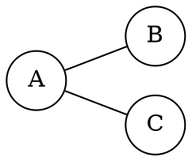

# Explicación completa - Laboratorio 3: Teoría de grafos

Actualizado hasta las partes 5 a 8 (caminos, ciclos y visualización), el 8 de octubre de 2026. El seguimiento está en [PLAN_INCREMENTAL.md](PLAN_INCREMENTAL.md). El alcance funcional del Lab 3 está implementado; la interfaz Python fue ejecutada y verificada, mientras la compilación y ejecución del C++ siguen pendientes en un equipo con compilador. Dijkstra, Bellman-Ford y la integración por `subprocess` corresponden al Lab 4 y no se mezclaron aquí.

## 1. ¿Qué se desarrolló?

Se desarrolló un programa de consola en C++ que permite crear y analizar un grafo simple mediante una matriz de adyacencia.

El programa permite:

- Definir entre 2 y 26 nodos.
- Asignar un nombre diferente a cada nodo: letras, números, palabras o símbolos.
- Elegir entre un grafo dirigido y uno no dirigido.
- Elegir, de forma independiente, si las aristas tienen pesos.
- Ingresar las conexiones del grafo.
- Construir y mostrar su matriz de adyacencia.
- Mostrar la representación matemática del grafo.
- Consultar los nodos adyacentes, sus grados y si el nodo está aislado.
- Comprobar si una secuencia de nodos es un camino.
- Comprobar si una secuencia forma un ciclo.
- Sumar el costo de una secuencia válida si el grafo es ponderado.
- Enumerar todos los caminos simples entre dos nodos.
- Buscar ciclos automáticamente en todos los componentes.
- Generar archivos DOT y JSON.
- Dibujar el grafo desde Python con nombres, flechas, pesos y nodos aislados.

El programa implementa solamente la Guía 3. No incluye rutas más cortas, Dijkstra, Bellman-Ford ni requisitos de la Guía 4.

## 2. Decisiones de diseño

### Programación procedural

El programa utiliza programación procedural: el problema se divide en funciones pequeñas, y cada función realiza una tarea específica.

Este enfoque se eligió porque:

- El programa administra un solo grafo durante cada ejecución.
- Las operaciones son pequeñas y fáciles de separar.
- Evita introducir clases que todavía no aportan una ventaja importante.
- Facilita explicar el código durante una sustentación.
- Mantiene el programa básico y entendible.

Utilizar POO también sería válido, pero no es necesario para cumplir el objetivo de esta práctica.

### Sin lazos ni aristas paralelas; con o sin pesos

Las dos elecciones son independientes: dirigido/no dirigido y ponderado/no ponderado. Por tanto, existen cuatro combinaciones.

- Sin pesos: `0` significa ausencia y `1` significa conexión. Se escogió la alternativa binaria permitida por HU-03; no se reciben `T/F`.
- Con pesos: `x` o `X` significa ausencia. Cualquier peso válido, **incluido cero**, significa que existe una conexión.
- No se admiten lazos: la diagonal debe ingresarse como `0` sin pesos o `x` con pesos. Un peso cero en la diagonal ponderada también es un lazo y se rechaza explicando cómo corregirlo.
- No se admiten aristas paralelas; cada par de nodos tiene una sola celda por dirección.
- Los pesos se guardan como `double`, entre `-1000000000` y `1000000000`, inclusive. Admiten negativos, decimales con punto y notación científica, por ejemplo `-1.25e2`.
- Se rechazan texto, valores no finitos (`nan`, `inf`), números fuera del rango y conversiones fuera del rango representable de `double`.

El límite numérico es una decisión práctica de esta consola, no un requisito del docente. Con secuencias de hasta 100 nodos, sumar sus pesos no desborda `double`. Eso no elimina los redondeos propios de los decimales en coma flotante. La presentación utiliza hasta 15 cifras significativas; no es aritmética decimal exacta.

### Límite de 26 nodos

Los nombres ya no están limitados al abecedario. Se conserva por ahora el máximo acordado de 26 nodos para la captura manual; el mínimo exigido por HU-02 es de dos.

Este límite también es razonable para una aplicación de consola. Una matriz de 26 nodos contiene 676 posiciones y una gráfica de ese tamaño puede ser difícil de leer.

## 3. Estructuras de datos principales

### Vector de nombres

```cpp
vector<string> nombresNodos;
```

Guarda el nombre completo de cada nodo, por ejemplo `a`, `v1`, `15`, `@` o `Nodo central`.

Por ejemplo:

```text
Índice:  0  1  2  3
Nodo:    A  B  C  D
```

El índice permite relacionar cada nombre con una fila y una columna de la matriz.

### Matriz de adyacencia

```cpp
struct Conexion {
    int existe = 0;
    double peso = 0;
};

vector<vector<Conexion>> matrizAdyacencia;
```

La matriz sigue siendo cuadrada. Ahora cada celda agrupa dos datos: si hay conexión y cuánto cuesta. El `struct` no tiene métodos, herencia ni lógica: es un registro sencillo; el diseño continúa siendo procedural.

`matriz[i][j].existe` contiene `1` si hay conexión y `0` si no. Se conserva como entero para poder validar explícitamente que sea binario.

`matriz[i][j].peso` guarda el costo. Una ausencia guarda `{0, 0}`; una arista de costo cero guarda `{1, 0}`. Son distintas. Las consultas y los caminos revisan `.existe`, nunca si el peso es diferente de cero. En modo no ponderado, una arista guarda `{1, 1}` como convención interna, pero no se presenta como ponderada.

Ejemplo:

```text
      A  B  C
  A   0  1  1
  B   1  0  0
  C   1  0  0
```

Este ejemplo representa las aristas `A-B` y `A-C`.

### Tipo de grafo

```cpp
enum class TipoGrafo {
    NoDirigido = 1,
    Dirigido = 2
};
```

El `enum class` evita trabajar por todo el programa con números sin significado evidente.

Es más claro escribir:

```cpp
tipo == TipoGrafo::Dirigido
```

que escribir:

```cpp
tipo == 2
```

## 4. Flujo general del programa

El programa sigue este orden:

```text
Inicio
  |
  v
Pedir cantidad de nodos
  |
  v
Pedir nombres únicos
  |
  v
Elegir tipo de grafo
  |
  v
Elegir si tiene pesos
  |
  v
Ingresar conexiones
  |
  v
Validar matriz
  |
  v
Mostrar resumen y matriz
  |
  v
Ejecutar menú de operaciones
  |
  v
Salir
```

La matriz se crea una sola vez. Después, el menú permite realizar varias consultas sobre el mismo grafo sin volver a ingresarlo.

## 5. Explicación de las funciones

### `leerEnteroEnRango`

```cpp
int leerEnteroEnRango(const string& mensaje, int minimo, int maximo,
                     const string& mensajeMinimo = "");
```

Solicita un número entero y comprueba que esté dentro de un rango.

La entrada se recibe primero como una línea de texto y luego se analiza con `stringstream`. Esto permite rechazar correctamente casos como:

```text
hola
3abc
1 2
-5
100
```

El programa continúa preguntando hasta recibir un único entero válido. `mensajeMinimo` permite explicar específicamente por qué se rechaza una cantidad menor que dos. Si se acaba la entrada, `leerLinea` cierra el programa con código 1 para evitar un ciclo infinito.

Esta función se reutiliza para:

- Cantidad de nodos.
- Tipo de grafo.
- Valores de la matriz no ponderada y selección de ponderación.
- Opciones del menú.
- Longitud de una secuencia.

### `leerLinea`

```cpp
string leerLinea(const string& mensaje);
```

Presenta un mensaje y recibe una línea completa, incluidos los espacios internos. Si falla la lectura o se cierra la entrada, informa el cierre y termina con código 1 mediante `exit(EXIT_FAILURE)`. Se centraliza esta comprobación para que las funciones que preguntan datos no se queden repitiendo mensajes.

### `nombreRepetido`

```cpp
bool nombreRepetido(const vector<string>& nombres, const string& nombre);
```

Compara el nombre con los ya registrados. La comparación es exacta: `A` y `a` son identificadores diferentes. Un duplicado se rechaza y se solicita otro nombre.

### `pedirNombreNodo`

```cpp
string pedirNombreNodo(const string& mensaje);
```

Recibe un nombre por línea. Quita espacios, tabulaciones y retornos de carro de los extremos mediante `find_first_not_of`, `find_last_not_of` y `substr`. Rechaza nombres vacíos y caracteres de control internos; conserva palabras, números, símbolos y espacios internos.

Ejemplos:

```text
a             -> válido; conserva la minúscula
AB            -> válido
15            -> válido
Nodo central  -> válido; es un solo nombre
@             -> válido
  v1          -> se guarda como v1
línea vacía   -> inválido
```

La modalidad es un nombre por línea: `A,B` representa un solo identificador, no dos nodos. Para consultarlo hay que escribir su nombre exacto; los espacios de los extremos se vuelven a quitar.

### `pedirCantidadNodos`

```cpp
int pedirCantidadNodos();
```

Utiliza `leerEnteroEnRango` para aceptar cantidades entre 2 y 26.

### `pedirNombresNodos`

```cpp
void pedirNombresNodos(vector<string>& nombres, int cantidad);
```

Solicita el nombre de cada nodo y evita nombres repetidos después de quitar los espacios de los extremos.

El vector se pasa por referencia porque la función debe modificarlo y agregar los nombres ingresados.

### `pedirTipoGrafo`

```cpp
TipoGrafo pedirTipoGrafo();
```

Presenta dos opciones:

```text
1. No dirigido
2. Dirigido
```

Luego transforma la opción numérica en un valor de `TipoGrafo`.

### `pedirPonderacion`

```cpp
bool pedirPonderacion();
```

Ofrece `1. No ponderado (0/1)` y `2. Ponderado (pesos numericos)`. Devuelve `true` para la segunda opción. Ese valor se pasa a las funciones que deben capturar o presentar los datos de forma diferente.

### `pesoValido`, `interpretarPeso`, `formatearPeso` y `textoConexion`

```cpp
bool pesoValido(double peso);
bool interpretarPeso(const string& texto, double& peso);
string formatearPeso(double peso);
string textoConexion(const Conexion& conexion, bool ponderado);
```

- `pesoValido` revisa que el número sea finito y su valor absoluto no supere mil millones.
- `interpretarPeso` usa `stod` para convertir un texto a `double`. Comprueba que se haya consumido todo el texto, por lo que `2abc` no se acepta como `2`. Captura las excepciones `invalid_argument` y `out_of_range` para no cerrar el programa ante un error. Solo modifica el parámetro `peso` cuando la conversión es válida. La captura elimina espacios de los extremos al extraer el dato con `stringstream`.
- `formatearPeso` convierte un número en texto, con hasta 15 cifras significativas, sin llenar los enteros de ceros decimales. Presenta `-0` como `0`.
- `textoConexion` decide qué mostrar en una celda: `0/1` en modo binario; `x` o el peso en modo ponderado. También sirve para describir conflictos de simetría.

### `pedirValorAdyacencia`

```cpp
int pedirValorAdyacencia(const string& origen, const string& destino, TipoGrafo tipo);
```

Pregunta si existe una conexión entre dos nodos.

En un grafo no dirigido se muestra:

```text
Existe la arista 'A' -- 'B'? (0/1):
```

En un grafo dirigido se muestra:

```text
Existe la arista 'A' -> 'B'? (0/1):
```

Solamente acepta `0` o `1`. Si el origen y el destino son el mismo nodo, el valor `1` representa un lazo. El programa informa qué nodo tiene el lazo, explica que esta versión trabaja con grafos simples y vuelve a pedir esa celda hasta recibir `0`.

### `pedirConexion`

```cpp
Conexion pedirConexion(const string& origen, const string& destino,
                        TipoGrafo tipo, bool ponderado);
```

Es la entrada común para una celda. Sin pesos, delega en `pedirValorAdyacencia`. Con pesos, pide un solo dato: `x` devuelve una ausencia; un número válido devuelve `{1, peso}`. Rechaza líneas vacías, varios datos en una línea y pesos incorrectos, repitiendo solo esa pregunta. Si el origen coincide con el destino, informa el lazo y exige `x`, incluso si el peso ingresado fue cero.

### `ingresarMatriz`

```cpp
void ingresarMatriz(
    vector<vector<Conexion>>& matriz,
    const vector<string>& nombres,
    TipoGrafo tipo, bool ponderado
);
```

Construye la matriz de adyacencia a partir de las conexiones indicadas por el usuario.

#### Grafo dirigido

En un grafo dirigido, `A -> B` no significa lo mismo que `B -> A`. Por lo tanto, se pregunta por cada dirección de manera independiente.

```text
Existe A -> B
Existe B -> A
```

Las dos respuestas pueden ser diferentes. Se recorren todas las celdas por filas, incluida la diagonal. Para dos nodos, el orden es `A-A`, `A-B`, `B-A`, `B-B`.

#### Grafo no dirigido

En un grafo no dirigido, `A -- B` es la misma arista que `B -- A`.

El programa pregunta una sola vez y copia el resultado en las dos posiciones:

```cpp
matriz[j][i] = matriz[i][j];
```

Así se garantiza automáticamente que la matriz sea simétrica.

Se pregunta también por la diagonal. En un grafo no dirigido se recorre el triángulo superior incluyéndola: para tres nodos, el orden es `A-A`, `A-B`, `A-C`, `B-B`, `B-C`, `C-C`. Los lazos se detectan, se informan y se rechazan; el usuario debe corregirlos a `0` sin pesos o `x` con pesos. La copia simétrica copia tanto la existencia como el peso. Un error en esa celda no obliga a volver a ingresar los nombres ni las conexiones anteriores.

### `validarMatriz`

```cpp
bool validarMatriz(
    const vector<vector<Conexion>>& matriz,
    const vector<string>& nombres,
    TipoGrafo tipo, bool ponderado,
    string& error
);
```

Comprueba que:

- La matriz tenga de 2 a 26 filas.
- La cantidad de filas coincida con la cantidad de nombres.
- El tipo de grafo sea válido.
- Todas las filas estén completas y la matriz sea cuadrada.
- Cada indicador `.existe` sea `0` o `1`.
- Cada peso sea finito y esté dentro del rango permitido.
- Las ausencias tengan peso interno cero; las aristas no ponderadas tengan peso interno uno.
- No existan conexiones en la diagonal, cualquiera que sea su peso.
- La existencia y el peso sean simétricos si el grafo es no dirigido.

Primero revisa el tamaño de **todas** las filas, antes de consultar cualquier celda. Esto evita leer fuera de los límites de un vector si una fila posterior está incompleta. Después revisa valores, diagonal y simetría.

Devuelve `true` si todo es correcto y deja `error` vacío. Si encuentra un problema, devuelve `false` y escribe una explicación en `error`, que se pasa por referencia. No imprime ni cambia la matriz: el `main` se encarga de mostrar el mensaje y pedir nuevamente la captura si falla la revisión final.

Ejemplos de mensajes:

```text
La fila de 'B' tiene 0 valores; se esperaban 2.
Valor invalido en ['A']['B']: 2. Solo se permite 0 o 1.
Se detecto un lazo en el nodo 'A'. La diagonal debe ser 0 en un grafo simple.
Inconsistencia: de 'A' a 'B' hay 1, pero de 'B' a 'A' hay 0. El grafo no dirigido debe ser simetrico.
```

La captura no dirigida mantiene la simetría automáticamente; la comprobación adicional permite rechazar una matriz inconsistente recibida de otra fuente en el futuro. Las pruebas unitarias construyen esas matrices inválidas directamente para verificarlo.

### `mostrarResumen`

```cpp
void mostrarResumen(
    const vector<string>& nombres,
    TipoGrafo tipo, bool ponderado
);
```

Muestra la cantidad de nodos, la dirección y si tiene pesos.

### `imprimirMatriz`

```cpp
void imprimirMatriz(
    const vector<vector<Conexion>>& matriz,
    const vector<string>& nombres, bool ponderado
);
```

Imprime los nombres de los nodos como encabezados de filas y columnas.

`setw` usa un ancho calculado a partir del nombre o valor mostrado más largo, más dos espacios. Así caben nombres compuestos y pesos extensos o negativos. El ancho se mide en bytes: algunos caracteres Unicode pueden verse desalineados según la terminal y su fuente. Con pesos se imprime una leyenda para recordar la diferencia entre `x` y `0`.

### `mostrarRepresentacionMatematica`

```cpp
void mostrarRepresentacionMatematica(
    const vector<vector<Conexion>>& matriz,
    const vector<string>& nombres,
    TipoGrafo tipo, bool ponderado
);
```

Muestra el conjunto de vértices:

```text
V = {"A", "B", "C"}
```

Para un grafo no dirigido muestra el conjunto de aristas:

```text
E = {{"A","B"}, {"A","C"}}
```

Los nombres se escriben con `quoted` para distinguir nombres que contengan comas o comillas.

Solamente recorre la parte superior de la matriz para no mostrar dos veces una arista como `A-B` y `B-A`.

Para un grafo dirigido muestra el conjunto de arcos:

```text
A = {<"A","B">, <"C","A">}
```

En este caso sí importa el orden de los nodos.

Si el grafo tiene pesos, se incluyen en cada conexión:

```text
G = (V, E)
E = {("A","B",0), ("B","C",-2.5)}

G = (V, A)
A = {<"A","B",0>, <"B","C",-2.5>}
```

La primera forma sigue representando aristas no dirigidas: cada par se lista una sola vez, con su peso. La segunda conserva el orden de origen y destino. Una ausencia no se imprime, pero una arista de peso cero sí. Si no hay conexiones, el conjunto correspondiente queda vacío: `E = {}` o `A = {}`.

### `buscarIndiceNodo`

```cpp
int buscarIndiceNodo(const vector<string>& nombres, const string& nombre);
```

Busca el nombre completo dentro del vector de nombres, respetando mayúsculas y minúsculas.

Devuelve:

- El índice del nodo cuando lo encuentra.
- `-1` cuando el nodo no existe.

### `pedirNodoExistente`

```cpp
int pedirNodoExistente(
    const vector<string>& nombres,
    const string& mensaje
);
```

Solicita un nombre y utiliza `buscarIndiceNodo` para comprobar que corresponda a un nodo registrado.

Si el nodo no existe, vuelve a pedirlo.

### `imprimirNodosEncontrados`

```cpp
void imprimirNodosEncontrados(
    const vector<string>& nombres,
    const vector<int>& indices
);
```

Recibe los índices encontrados durante una consulta y muestra los nombres correspondientes.

Si el vector está vacío, imprime `Ninguno`.

### `mostrarAdyacentes`

```cpp
void mostrarAdyacentes(
    int indice,
    const vector<vector<Conexion>>& matriz,
    const vector<string>& nombres,
    TipoGrafo tipo
);
```

En un grafo no dirigido, revisa la fila del nodo y muestra todos sus vecinos. Su grado es la cantidad de vecinos, no la suma de sus pesos. Como no hay lazos ni aristas paralelas, basta con contar las conexiones existentes.

En un grafo dirigido distingue:

- Sucesores: nodos hacia los que sale una arista; su cantidad es el grado de salida.
- Predecesores: nodos desde los que llega una arista; su cantidad es el grado de entrada.

Para encontrar sucesores se revisa una fila:

```cpp
matriz[indice][j].existe
```

Para encontrar predecesores se revisa una columna:

```cpp
matriz[j][indice].existe
```

Si no tiene conexiones incidentes, informa explícitamente que es un nodo aislado. En un grafo dirigido deben estar vacíos **ambos** conjuntos: tener solo entradas o solo salidas no significa estar aislado. Las aristas con peso cero o negativo también cuentan.

### `pedirSecuenciaNodos`

```cpp
vector<int> pedirSecuenciaNodos(const vector<string>& nombres);
```

Solicita la longitud de una secuencia y después pide cada nodo.

La secuencia se guarda mediante índices para poder consultar directamente la matriz.

Si el usuario introduce:

```text
A B C D
```

la función podría devolver:

```text
0 1 2 3
```

### `esCamino`

```cpp
bool esCamino(
    const vector<int>& secuencia,
    const vector<vector<Conexion>>& matriz
);
```

Una secuencia es un camino cuando cada par consecutivo está conectado.

Para la secuencia `A B C`, se comprueba:

```text
A con B
B con C
```

Si alguna de esas conexiones no existe, la secuencia no es un camino. Se revisa `.existe`; un peso cero o negativo no invalida la conexión.

La longitud del camino es el número de nodos menos uno:

```text
A B C D
4 nodos - 1 = 3 aristas
```

### `esCaminoSimple`

```cpp
bool esCaminoSimple(const vector<int>& secuencia);
```

Comprueba que no se repitan nodos, con la excepción de que el último puede ser igual al primero.

Ejemplos:

```text
A B C D   -> camino simple
A B C A   -> puede ser camino simple y ciclo simple
A B A C   -> no es simple porque A se repite internamente
```

Se utiliza un `set` porque no permite valores repetidos.

### `tieneAristasDiferentes`

```cpp
bool tieneAristasDiferentes(const vector<int>& secuencia);
```

En un grafo no dirigido, un ciclo debe utilizar aristas diferentes.

La arista `A-B` se considera igual a `B-A`. Para normalizar cada arista se guarda primero el índice menor y después el mayor.

Por eso la secuencia:

```text
A B A
```

no se acepta como ciclo no dirigido: utiliza dos veces la misma arista.

### `esCiclo`

```cpp
bool esCiclo(
    const vector<int>& secuencia,
    const vector<vector<Conexion>>& matriz,
    TipoGrafo tipo
);
```

Una secuencia forma un ciclo cuando:

- Contiene por lo menos tres posiciones.
- Es un camino válido.
- El primer nodo es igual al último.
- En un grafo no dirigido, no repite aristas.

Ejemplo:

```text
A B C A
```

### `analizarSecuencia`

```cpp
void analizarSecuencia(
    const vector<int>& secuencia,
    const vector<vector<Conexion>>& matriz,
    TipoGrafo tipo, bool ponderado
);
```

Agrupa las comprobaciones anteriores y presenta un resultado entendible:

```text
La secuencia es un camino simple. Longitud: 3 aristas.
También forma un ciclo simple.
```

O, si falta una conexión:

```text
La secuencia no es un camino.
```

Si tiene pesos y la secuencia es válida, suma el `.peso` de cada conexión consecutiva y muestra `Costo total`. La longitud sigue contando aristas: no se confunde con el costo. Una secuencia de un solo nodo tiene longitud y costo cero. Esta operación analiza la secuencia ingresada; la opción 6 realiza la búsqueda automática, pero tampoco calcula una ruta mínima.

### Búsqueda automática de caminos simples

Las funciones `explorarCaminosSimples` y `buscarCaminosSimples` implementan DFS con retroceso. Se marca el nodo actual, se intenta cada vecino no visitado y se desmarca al regresar. Así, una rama no impide explorar otra.

```text
A -> B -> D
A -> C -> D
```

Un camino se guarda al alcanzar el destino. No se continúa desde allí, porque cualquier extensión dejaría de ser un recorrido de origen a destino. La opción 6 muestra cada secuencia, el número de aristas, que es simple y su costo si tiene pesos. Si no encuentra ninguna, identifica ambos nodos en el mensaje.

Solamente se enumeran caminos simples, sin repetir vértices. Si se permitieran repeticiones, cualquier ciclo podría recorrerse una cantidad arbitraria de veces y existirían infinitos recorridos. No se aplica un límite oculto ni se omiten resultados; por ello, un grafo denso puede producir factorialmente muchos caminos y tardar bastante.

### Origen igual al destino

Cuando ambos nombres son iguales, el programa no devuelve el recorrido vacío. `explorarCiclosDesdeOrigen` busca caminos cerrados simples que salgan del nodo y vuelvan a él. En grafos no dirigidos descarta la orientación inversa duplicada mediante los índices del segundo y penúltimo vértice; `A-B-C-A` y `A-C-B-A` representan el mismo ciclo. Un recorrido `A-B-A` tampoco se acepta en un grafo no dirigido porque usa dos veces la misma arista. En un dígrafo, `A->B->A` sí puede ser un ciclo de dos arcos diferentes.

### Detección automática global de ciclos

`buscarUnCiclo` inicia una búsqueda desde cada nodo todavía no visitado, por lo que también inspecciona componentes desconectados. `buscarCicloDFS` emplea tres estados:

- `0`: no visitado.
- `1`: activo en la rama actual.
- `2`: recorrido terminado.

Encontrar una arista hacia un nodo activo permite reconstruir el ciclo desde la pila. En grafos no dirigidos se ignora la conexión inmediata hacia el padre para no confundir `A-B-A` con un ciclo. La opción 7 presenta un ciclo testigo, su longitud, clasificación y costo, o informa que el grafo es acíclico.

### Funciones de presentación de recorridos

`calcularCosto` suma los pesos de las conexiones consecutivas; en modo no ponderado su resultado interno coincidiría con la longitud, pero solo se imprime para grafos ponderados. `imprimirRecorrido` traduce índices a nombres y los separa con flechas. `mostrarCaminosEntre` y `mostrarDeteccionCiclos` reúnen la búsqueda y los mensajes de consola.

### `generarArchivoDOT`

```cpp
bool generarArchivoDOT(
    const vector<vector<Conexion>>& matriz,
    const vector<string>& nombres,
    TipoGrafo tipo, bool ponderado,
    const string& nombreArchivo
);
```

Crea un archivo de texto llamado `grafo.dot`.

Para un grafo no dirigido genera algo similar a:



Para un grafo dirigido utiliza `digraph` y el conector `->`.

Si es ponderado, cada arista lleva una etiqueta, por ejemplo `n0 -- n1 [label="0"];`. Se conserva el peso cero y se omiten únicamente las ausencias. DOT queda como formato adicional; la visualización de HU-06 se realiza en Python.

Los identificadores internos `n0`, `n1`, etc. evitan conflictos con palabras reservadas o símbolos en los nombres. `quoted` escribe las etiquetas entre comillas y escapa comillas y barras invertidas. Al cerrar el archivo se comprueba si ocurrió un error de escritura.

Los nodos se declaran aunque estén aislados. Esto garantiza que también aparezcan en la gráfica.

### `escaparJSON` y `generarArchivoDatos`

`escaparJSON` protege comillas, barras invertidas y caracteres especiales dentro de un nombre. `generarArchivoDatos` crea `grafo.json` con esta estructura:

```json
{
  "dirigido": true,
  "ponderado": true,
  "nodos": ["A", "B", "C"],
  "aristas": [
    {"origen": 0, "destino": 1, "peso": 0},
    {"origen": 1, "destino": 2, "peso": -2.5}
  ]
}
```

Los índices evitan ambigüedades con nombres arbitrarios. Una conexión no dirigida se escribe una sola vez. Los nodos se listan aparte, de modo que un aislado también llega a Python. El peso solo aparece en grafos ponderados.

### `interfaz.py`

La interfaz recibe `grafo.json`, comprueba la estructura y dibuja con Matplotlib. Antes de dibujar valida booleanos, mínimo de nodos, nombres únicos, índices, lazos, conexiones repetidas y pesos numéricos finitos.

La distribución circular asigna una posición a cada nodo. Los dígrafos usan flechas; dos arcos opuestos se curvan en sentidos diferentes. Los pesos aparecen junto a sus conexiones, incluido cero. Cada nombre se escribe dentro de su nodo y los aislados se conservan porque las posiciones se crean a partir de la lista completa de nodos.

Uso interactivo:

```powershell
python interfaz.py grafo.json
```

Guardar una evidencia sin abrir la ventana:

```powershell
python interfaz.py grafo.json --guardar grafo.png --sin-mostrar
```

También puede guardar SVG o PDF según la extensión. Si Matplotlib no está instalado:

```powershell
python -m pip install -r requirements.txt
```

### `mostrarMenu`

Presenta las operaciones disponibles:

```text
1. Mostrar matriz de adyacencia
2. Mostrar representación matemática
3. Consultar nodos adyacentes
4. Verificar camino o ciclo
5. Generar archivos DOT y JSON para la gráfica
6. Buscar todos los caminos entre dos nodos
7. Detectar ciclos automáticamente
0. Salir
```

### `main`

`main` coordina el programa:

1. Solicita los datos básicos.
2. Pide si tiene pesos y crea una matriz de conexiones ausentes (`{0, 0}`).
3. Ingresa las conexiones.
4. Valida la matriz y muestra el motivo si hace falta volver a capturarla.
5. Muestra la información inicial.
6. Mantiene activo el menú hasta seleccionar `0`.

La lógica detallada permanece en funciones independientes, por lo que `main` se puede leer como un resumen del programa.

## 6. Diferencia entre grafos dirigidos y no dirigidos

### No dirigido

Una arista no tiene dirección:

```text
A -- B
```

Es equivalente a:

```text
B -- A
```

Su matriz debe ser simétrica:

```text
matriz[A][B].existe == matriz[B][A].existe
matriz[A][B].peso == matriz[B][A].peso
```

### Dirigido

Un arco sí tiene dirección:

```text
A -> B
```

No implica que exista:

```text
B -> A
```

Por eso su matriz puede ser asimétrica.

## 7. Ejemplo completo: grafo no dirigido

Se utilizarán tres nodos:

```text
A, B, C
```

Y tres aristas:

```text
A-B
A-C
B-C
```

### Respuestas de entrada

```text
Cantidad de nodos: 3
Nodo 1: A
Nodo 2: B
Nodo 3: C
Tipo: 1
Ponderacion: 1 (no ponderado)
A -- A: 0
A -- B: 1
A -- C: 1
B -- B: 0
B -- C: 1
C -- C: 0
```

### Matriz esperada

```text
      A  B  C
  A   0  1  1
  B   1  0  1
  C   1  1  0
```

### Representación matemática esperada

```text
V = {"A", "B", "C"}
E = {{"A","B"}, {"A","C"}, {"B","C"}}
```

### Consulta de adyacentes

Para el nodo `A`:

```text
Adyacentes de A: B, C
Grado: 2
```

### Camino

Secuencia:

```text
A B C
```

Resultado:

```text
La secuencia es un camino simple. Longitud: 2 aristas.
No forma un ciclo.
```

### Ciclo

Secuencia:

```text
A B C A
```

Resultado:

```text
La secuencia es un camino simple. Longitud: 3 aristas.
También forma un ciclo simple.
```

## 8. Ejemplo completo: grafo dirigido

Nodos:

```text
A, B, C
```

Arcos:

```text
A -> B
B -> C
C -> A
```

### Matriz

```text
      A  B  C
  A   0  1  0
  B   0  0  1
  C   1  0  0
```

### Representación matemática

```text
V = {"A", "B", "C"}
A = {<"A","B">, <"B","C">, <"C","A">}
```

### Consulta del nodo A

```text
Sucesores de A: B
Predecesores de A: C
Grado de salida: 1
Grado de entrada: 1
```

### Secuencia

```text
A B C A
```

Forma un ciclo dirigido porque existen los tres arcos en el orden indicado.

La secuencia inversa `A C B A` no es un camino, salvo que también existan esos arcos en sentido contrario.

### Ejemplo ponderado para practicar

Crear `A`, `B`, `C`; escoger tipo `1` y ponderación `2`. Ingresar, en orden:

```text
A -- A: x
A -- B: 0
A -- C: x
B -- B: x
B -- C: -2.5
C -- C: x
```

La matriz impresa es:

```text
           A     B     C
     A     x     0     x
     B     0     x  -2.5
     C     x  -2.5     x
```

En la opción 2 aparecerá `E = {("A","B",0), ("B","C",-2.5)}`. En la opción 4, ingresar longitud `3` y los nombres `A`, `B`, `C`: debe informar longitud de dos aristas y costo `-2.5`. `A C` no es camino; `A B A` tiene costo cero, pero no es ciclo no dirigido porque repite la misma arista.

En la opción 3, consultar `B`: sus vecinos son `A, C` y su grado es `2`, no `-2.5`. Estos son resultados esperados para verificar cuando se compile el programa.

## 9. Visualización Python y alternativa Graphviz

La opción 5 del menú crea:

```text
grafo.dot
grafo.json
```

La opción principal es abrir `grafo.json` con `interfaz.py`, como se explicó arriba. `grafo.dot` se conserva como alternativa y evidencia textual.

Si Graphviz está instalado, se convierte en PNG con:

```powershell
dot -Tpng grafo.dot -o grafo.png
```

También se puede producir un archivo SVG:

```powershell
dot -Tsvg grafo.dot -o grafo.svg
```

Para comprobar si Graphviz está instalado:

```powershell
dot -V
```

Las imágenes generadas con Python o Graphviz se pueden utilizar como evidencia en el informe.

## 10. Compilación y ejecución

Con `g++`:

```powershell
g++ -std=c++17 -Wall -Wextra -pedantic algoritmo.cpp -o algoritmo.exe
```

Para ejecutar:

```powershell
.\algoritmo.exe
```

Después de escoger la opción 5:

```powershell
python interfaz.py grafo.json
```

Significado de las opciones:

- `-std=c++17`: utiliza el estándar C++17.
- `-Wall`: activa advertencias comunes.
- `-Wextra`: activa advertencias adicionales.
- `-pedantic`: detecta construcciones que no siguen estrictamente el estándar.
- `-o algoritmo.exe`: establece el nombre del ejecutable.

## 11. Casos de prueba recomendados

Las pruebas de consola cubren nodos, matriz, pesos, grados, caminos, ciclos y los archivos DOT/JSON. Las unidades C++ llaman directamente a la implementación real. `probar_interfaz.py` valida y renderiza imágenes reales sin abrir ventanas.

```powershell
g++ -std=c++17 -Wall -Wextra -pedantic algoritmo.cpp -o algoritmo.exe
python pruebas/probar_hu02.py .\algoritmo.exe
python pruebas/probar_hu04.py .\algoritmo.exe
python pruebas/probar_ponderados.py .\algoritmo.exe
python pruebas/probar_hu07.py .\algoritmo.exe
python pruebas/probar_caminos_ciclos.py .\algoritmo.exe
g++ -std=c++17 -Wall -Wextra -pedantic -D_GLIBCXX_ASSERTIONS pruebas/validar_matriz.cpp -o prueba_matriz.exe
.\prueba_matriz.exe
g++ -std=c++17 -Wall -Wextra -pedantic -D_GLIBCXX_ASSERTIONS pruebas/validar_pesos.cpp -o prueba_pesos.exe
.\prueba_pesos.exe
g++ -std=c++17 -Wall -Wextra -pedantic -D_GLIBCXX_ASSERTIONS pruebas/validar_recorridos.cpp -o prueba_recorridos.exe
.\prueba_recorridos.exe
python pruebas/probar_interfaz.py
```

Compilar cada archivo C++ por separado. El archivo de pruebas incluye `algoritmo.cpp` y cambia el nombre de su `main` solo durante esa compilación, para probar la función verdadera sin duplicar su implementación. `-D_GLIBCXX_ASSERTIONS` activa comprobaciones adicionales al usar GCC/libstdc++ y ayuda a detectar accesos fuera de rango.

La prueba Python de la interfaz sí se ejecutó correctamente: verificó renderizado dirigido/no dirigido, pesos, nodo aislado, UTF-8, 26 posiciones y diez errores estructurales. Las pruebas funcionales que necesitan el ejecutable y las unidades C++ no se han ejecutado en este entorno por falta de compilador. No confundir sus resultados esperados con resultados ya observados.

### Prueba 1: entradas inválidas

Intentar ingresar:

- Texto en la cantidad de nodos.
- `0` nodos.
- Más de 26 nodos.
- Dos nombres iguales, incluso si uno tiene espacios adicionales en los extremos.
- Un nombre vacío o con caracteres de control internos.

Los símbolos imprimibles sí son nombres válidos. Continuar probando:

- Un valor diferente de `0` o `1` para una conexión no ponderada.
- `1` en la diagonal no ponderada; debe informar el lazo y volver a pedir esa celda.
- Un peso `nan`, `inf`, `2abc`, `2,5` o fuera del rango numérico.
- Un peso `0` en la diagonal ponderada; debe detectar el lazo y pedir `x`.
- Una opción del menú fuera del rango.

El programa debe mostrar un mensaje y volver a solicitar el dato.

### Prueba 2: nodo aislado

Crear tres nodos y conectar únicamente `A-B`.

El nodo `C` debe:

- Aparecer en la matriz.
- Aparecer en el conjunto `V`.
- Mostrar `Ninguno` al consultar sus adyacentes.
- Mostrar grado cero y el aviso de nodo aislado.
- Aparecer en el archivo DOT.

### Prueba 3: camino inválido

Crear las conexiones:

```text
A-B
B-C
```

Probar la secuencia:

```text
A C
```

Debe responder que no es un camino.

### Prueba 4: ciclo no dirigido inválido

Crear únicamente `A-B` y probar:

```text
A B A
```

Es una secuencia conectada, pero no se considera ciclo no dirigido porque utiliza la misma arista dos veces.

### Prueba 5: dirección incorrecta

Crear solamente:

```text
A -> B
```

La secuencia `A B` debe ser camino. La secuencia `B A` no debe serlo.

## 12. Complejidad básica

### Memoria

La matriz utiliza espacio proporcional a:

```text
n × n
```

Por eso su complejidad espacial es:

```text
O(n²)
```

### Construcción

En un grafo dirigido se revisan casi todas las posiciones de la matriz:

```text
O(n²)
```

En uno no dirigido se revisa aproximadamente la mitad, pero su orden de complejidad continúa siendo:

```text
O(n²)
```

### Consultar una arista

Comprobar si existe una conexión entre dos nodos mediante la matriz cuesta:

```text
O(1)
```

### Consultar adyacentes

Se recorre una fila y, en grafos dirigidos, también una columna:

```text
O(n)
```

### Verificar un camino

Si la secuencia contiene `k` nodos, se revisan `k-1` conexiones:

```text
O(k)
```

### Enumerar caminos simples

La búsqueda explora combinaciones de vértices sin repetirlos. Su costo depende de cuántos caminos existan y, en el peor caso de un grafo denso, crece factorialmente. Guardar los resultados también requiere espacio proporcional al total de recorridos encontrados. Este costo es inevitable si se exige mostrar todos los caminos.

### Detectar un ciclo

Cada nodo se procesa una vez, pero al usar una matriz se revisa una fila completa para buscar sus vecinos. Por eso la detección cuesta `O(n²)` y utiliza `O(n)` para estados, pila y ciclo testigo.

## 13. Posibles preguntas durante la sustentación

### ¿Por qué utilizar una matriz de adyacencia?

Porque es la representación solicitada en la guía y permite consultar directamente si existe una conexión entre dos nodos.

### ¿Por qué la matriz de un grafo no dirigido es simétrica?

Porque si existe `A-B`, también existe `B-A`. Las posiciones `[A][B]` y `[B][A]` deben contener el mismo valor.

### ¿Por qué la diagonal contiene ceros o `x`?

Porque esta versión no permite aristas desde un nodo hacia sí mismo. Sin pesos, la ausencia se presenta con `0`; con pesos se presenta con `x`, pues un peso cero es una conexión real.

### ¿Cuál es la diferencia entre adyacentes, sucesores y predecesores?

En un grafo no dirigido se habla de vecinos o adyacentes. En un grafo dirigido, los sucesores reciben una arista desde el nodo consultado y los predecesores envían una arista hacia él.

### ¿Cómo se determina si una secuencia es un camino?

Se consulta la matriz para verificar que cada par consecutivo de la secuencia esté conectado.

### ¿Cómo se determina si es un ciclo?

Primero debe ser un camino. Además, el primer nodo debe ser igual al último. En grafos no dirigidos no se permite repetir la misma arista.

### ¿Por qué se buscan caminos simples?

Porque repetir vértices permitiría dar vueltas indefinidamente alrededor de un ciclo, generando infinitos recorridos. Los caminos simples forman un conjunto finito y cumplen la exploración exhaustiva mediante retroceso.

### ¿Cómo se evita el falso ciclo `A-B-A`?

Durante la detección no dirigida se ignora la arista que regresa inmediatamente al padre. Durante la enumeración, `esCiclo` también exige que las aristas del recorrido no se repitan.

### ¿La búsqueda automática calcula la ruta más corta?

No. Enumera todos los caminos simples y muestra longitud/costo. Dijkstra y Bellman-Ford pertenecen al Lab 4.

### ¿Por qué no se usó POO?

Porque el alcance actual se resuelve claramente mediante funciones y un solo conjunto de datos. Una clase sería útil si el programa administrara varios grafos o creciera considerablemente.

### ¿Por qué se utilizó `const vector<...>&`?

La referencia evita copiar el vector completo y `const` garantiza que la función no lo modifique accidentalmente.

### ¿Por qué se genera un archivo DOT?

Porque permite representar grafos dirigidos y no dirigidos con poco código, y Graphviz se encarga de calcular automáticamente la posición de los nodos y dibujar las aristas.

### ¿Para qué sirve `grafo.json`?

Es un formato de intercambio independiente de la consola. C++ exporta el grafo y Python lo valida y dibuja sin tener que interpretar mensajes destinados al usuario.

## 14. Limitaciones conocidas

Estas son las limitaciones de la versión actual:

- Los nombres se ingresan uno por línea y distinguen mayúsculas de minúsculas.
- El máximo es de 26 nodos.
- No se permiten lazos.
- Los pesos se limitan al intervalo de ±mil millones, con la precisión aproximada de `double`; la salida muestra hasta 15 cifras significativas.
- Enumerar todos los caminos puede tardar mucho y consumir memoria en grafos densos; no se ocultan ni truncan resultados.
- La distribución gráfica es circular y no garantiza eliminar todos los cruces en grafos densos.
- La ventana Python se inicia con un comando después de exportar; el `subprocess` automático pertenece a la arquitectura del Lab 4.
- El JSON conserva el grafo, pero el programa C++ todavía no vuelve a cargarlo en otra ejecución.
- No se calculan rutas mínimas ni métricas de Dijkstra/Bellman-Ford.

## 15. Evidencias recomendadas para el informe

Conviene tomar capturas de:

1. Ingreso de nodos y tipo de grafo.
2. Ingreso de las conexiones.
3. Matriz de adyacencia terminada.
4. Representación matemática.
5. Consulta de adyacentes.
6. Camino válido.
7. Camino inválido.
8. Enumeración de varios caminos y un caso sin camino.
9. Ciclo detectado automáticamente y grafo acíclico.
10. Ventana o imagen Python con flechas, pesos y nodo aislado.
11. Archivos DOT/JSON generados.
12. Una validación rechazando un dato incorrecto.

Cada captura debe acompañarse con una explicación corta del resultado.

## 16. Estructura sugerida del informe IEEE

El informe puede organizarse así:

1. **Título y autores.**
2. **Resumen:** propósito, método y resultado principal.
3. **Palabras clave:** grafos, matriz de adyacencia, camino, ciclo, C++.
4. **Introducción:** problema y utilidad de la teoría de grafos.
5. **Fundamento teórico:** vértices, aristas, grafos dirigidos, caminos, ciclos y adyacencia.
6. **Metodología:** decisiones de diseño y construcción del programa.
7. **Implementación:** estructuras de datos y funciones principales.
8. **Pruebas y resultados:** casos ejecutados y capturas.
9. **Análisis:** comportamiento, validaciones y limitaciones.
10. **Conclusiones:** cumplimiento de los objetivos y aprendizajes.
11. **Referencias:** bibliografía de la guía y otras fuentes utilizadas.
12. **Anexo:** código fuente completo.

## 17. Lista de verificación antes de entregar

- [ ] El código compila sin errores.
- [ ] No aparecen advertencias importantes.
- [ ] Se probó un grafo dirigido.
- [ ] Se probó un grafo no dirigido.
- [ ] Se probaron pesos negativos, decimales y cero frente a ausencia.
- [ ] Se probó un nodo aislado.
- [ ] Se comprobó un camino válido y uno inválido.
- [ ] Se comprobó un ciclo válido.
- [ ] Se enumeraron todos los caminos de un ejemplo conocido.
- [ ] Se detectó un ciclo en un componente desconectado y se probó un grafo acíclico.
- [ ] Se generó `grafo.dot`.
- [ ] Se generó y validó `grafo.json`.
- [ ] Se generó una imagen del grafo.
- [ ] Se guardaron capturas de las pruebas.
- [ ] El informe sigue el formato IEEE.
- [ ] El código está anexado al informe.
- [ ] Los nombres de los archivos son claros.
- [ ] No se incluyeron funciones de la Guía 4.

## 18. Archivos del proyecto

```text
algoritmo.cpp          Programa actual del Laboratorio 3.
interfaz.py            Validador y visualizador del grafo con Matplotlib.
requirements.txt       Dependencia Python reproducible.
.gitignore             Excluye ejecutables, cachés y gráficas generadas.
PLAN_LAB3.md           Plan y etapas de desarrollo.
EXPLICACION_LAB3.md    Explicación completa del programa.
PLAN_INCREMENTAL.md   Entregas por historia de usuario.
pruebas/probar_hu02.py Pruebas del ejecutable para la parte 1.
pruebas/probar_hu04.py Pruebas de captura y corrección de lazos.
pruebas/validar_matriz.cpp Pruebas directas de integridad de la matriz.
pruebas/probar_ponderados.py Pruebas de consola, costos y DOT con pesos.
pruebas/validar_pesos.cpp Pruebas directas de pesos, estructura y conexiones.
pruebas/probar_hu07.py Pruebas de grados y nodos aislados.
pruebas/probar_caminos_ciclos.py Pruebas funcionales de HU-08 y HU-09.
pruebas/validar_recorridos.cpp Pruebas directas de recorridos y ciclos.
pruebas/probar_interfaz.py Pruebas ejecutables del JSON y el renderizado.
algoritmo_previo.cpp   Respaldo de la versión anterior.
```

Después de ejecutar la opción gráfica también puede aparecer:

```text
grafo.dot              Descripción del grafo para Graphviz.
grafo.json             Datos que consume la interfaz Python.
grafo.png              Imagen opcional generada con Python o Graphviz.
```

## 19. Checklist para hacer el push

Primero se debe revisar el estado del repositorio:

```powershell
git status
```

Agregar únicamente los archivos que realmente se quieran publicar:

```powershell
git add .gitignore algoritmo.cpp interfaz.py requirements.txt PLAN_LAB3.md EXPLICACION_LAB3.md PLAN_INCREMENTAL.md pruebas/probar_hu02.py pruebas/probar_ponderados.py pruebas/probar_caminos_ciclos.py pruebas/validar_recorridos.cpp pruebas/probar_interfaz.py
```

El archivo `algoritmo_previo.cpp` es un respaldo. Se puede conservar localmente o incluirlo solamente si el equipo considera útil mostrar la evolución. No es necesario para ejecutar la versión final.

Crear el commit:

```powershell
git commit -m "Completar caminos ciclos y visualizacion del Lab 3"
```

Finalmente:

```powershell
git push
```

Antes del `push`, es importante comprobar que no se estén agregando ejecutables, archivos temporales o imágenes innecesarias.

## 20. Resumen corto para explicar el proyecto

El programa construye un grafo dirigido o no dirigido, con o sin pesos y sin lazos ni aristas paralelas. Cada celda distingue existencia y costo, por lo que admite pesos cero y negativos. Valida la matriz, muestra su forma matemática, consulta vecinos y grados, identifica nodos aislados, verifica secuencias, enumera todos los caminos simples y detecta ciclos en cualquier componente. C++ exporta DOT y JSON; Python valida el JSON y dibuja nombres, flechas, pesos y nodos aislados mediante Matplotlib. La solución sigue siendo procedural y no incluye rutas mínimas, que pertenecen al Lab 4.
