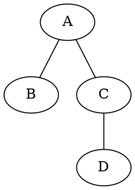

# Plan de desarrollo - Laboratorio 3: Teoría de grafos

Este es el plan de la base inicial, actualizado en nombres de nodos para HU-02 y validaciones binarias para HU-04. Las ampliaciones exigidas por las historias de usuario y el orden de los próximos commits están en [PLAN_INCREMENTAL.md](PLAN_INCREMENTAL.md). Que una función aparezca implementada aquí no significa que cumpla todos los criterios de las historias nuevas.

## 1. Objetivo

Desarrollar en C++ un programa de consola que permita construir y analizar un grafo mediante una matriz de adyacencia. El programa debe generar:

- La representación matemática del grafo.
- Una representación gráfica.
- Evidencias de los conceptos de camino, ciclo y nodos adyacentes.
- Validaciones suficientes para impedir datos inconsistentes.

Este plan cubre solamente la Guía 3. No incluye algoritmos de ruta más corta ni requisitos de la Guía 4.

## Estado de implementación

- [x] Entrada segura de nodos y tipo de grafo.
- [x] Construcción y validación de la matriz de adyacencia.
- [x] Representación matemática de vértices y aristas.
- [x] Consulta de nodos adyacentes.
- [x] Verificación de caminos y ciclos.
- [x] Menú de operaciones.
- [x] Exportación del grafo a formato DOT.
- [ ] Compilación y ejecución de los casos de prueba en un entorno con compilador C++.
- [ ] Preparación del informe IEEE y sus evidencias.

## 2. Enfoque recomendado

Se utilizará programación procedural.

Para el tamaño de esta práctica, las funciones independientes son más sencillas de leer, probar y explicar que una jerarquía de clases. No se necesita POO mientras el programa maneje un solo grafo durante su ejecución.

Principios para el código:

- Una función por responsabilidad.
- Nombres descriptivos en español.
- Sin variables globales.
- Parámetros constantes por referencia cuando no deban modificarse.
- Comentarios solamente para decisiones que no sean evidentes.
- Mensajes de consola breves y consistentes.
- Mínimo de 2 y máximo de 26 nodos, con nombres personalizados únicos.

## 3. Alcance funcional

El programa tendrá el siguiente flujo:

1. Solicitar la cantidad de nodos.
2. Solicitar un nombre único por línea para cada nodo.
3. Preguntar si el grafo es dirigido o no dirigido.
4. Ingresar la matriz de adyacencia.
5. Validar la integridad de la matriz.
6. Mostrar la matriz con los nombres de los nodos.
7. Mostrar la representación matemática del grafo.
8. Consultar los nodos adyacentes.
9. Verificar secuencias como caminos o ciclos.
10. Generar la representación gráfica.

### Decisión sobre el tipo de grafo

La primera versión trabajará con grafos simples y no ponderados:

- `0`: no existe arista.
- `1`: existe arista.
- La diagonal principal debe contener ceros; no se permitirán lazos.
- En un grafo no dirigido, la matriz debe ser simétrica.
- En un grafo dirigido, la matriz no necesita ser simétrica.

La opción actual de grafo "etiquetado" debe retirarse si no produce ningún comportamiento diferente. La base inicial es no ponderada. Las nuevas HU-01, HU-03 y HU-05 también exigen pesos: se incorporarán en la parte 3 del plan incremental, antes de las rutas mínimas.

## 4. Estructuras de datos

Se conservarán estructuras básicas de la biblioteca estándar:

```cpp
vector<string> nombresNodos;
vector<vector<int>> matrizAdyacencia;
```

No se necesita crear una clase `Grafo` en esta etapa. El tipo del grafo puede almacenarse como un `bool dirigido` o mediante un `enum` sencillo:

```cpp
enum class TipoGrafo {
    NoDirigido,
    Dirigido
};
```

El `enum` es preferible a usar números mágicos como `1` y `2` después de leer la opción del usuario.

## 5. Ingreso de la matriz

La matriz se ingresará celda por celda, aceptando únicamente `0` o `1`.

Para un grafo dirigido se piden todas las posiciones, incluida la diagonal. Si se escribe `1` en la diagonal, se informa el lazo y se solicita corregir esa celda a `0`, porque se conserva el alcance de grafos simples.

Para un grafo no dirigido se pide solamente la mitad superior de la matriz, incluida la diagonal, y se copia automáticamente cada valor en su posición simétrica:

```cpp
matriz[i][j] = valor;
matriz[j][i] = valor;
```

Esto garantiza la simetría y evita pedir dos veces la misma arista. Al finalizar se imprimirá la matriz completa.

## 6. Funciones previstas

### Entrada y validación

```cpp
int pedirCantidadNodos();
void pedirNombresNodos(vector<string>& nombres, int cantidad);
TipoGrafo pedirTipoGrafo();
int pedirValorAdyacencia(const string& origen, const string& destino, TipoGrafo tipo);
void ingresarMatriz(vector<vector<int>>& matriz, const vector<string>& nombres, TipoGrafo tipo);
bool validarMatriz(const vector<vector<int>>& matriz, const vector<string>& nombres,
                   TipoGrafo tipo, string& error);
```

Las validaciones mínimas serán:

- Cantidad entre 2 y 26.
- Entradas numéricas válidas.
- Nombres no vacíos: letras, números, palabras y símbolos imprimibles. Se distinguen mayúsculas de minúsculas.
- Nombres no repetidos.
- Valores de matriz limitados a `0` y `1`.
- Diagonal principal igual a cero.
- Simetría para grafos no dirigidos.

La validación comprueba todos los tamaños antes de acceder a celdas. Si algo falla, devuelve una explicación que identifica la fila, celda, nodo o par de nodos involucrado. La captura permite corregir los datos; los lazos se informan y rechazan.

La entrada se recibe con `getline` y se analiza con `stringstream`. Si se cierra la entrada, se finaliza con un aviso y código 1.

### Presentación del grafo

```cpp
void mostrarResumen(const vector<string>& nombres, TipoGrafo tipo);
void imprimirMatriz(
    const vector<vector<int>>& matriz,
    const vector<string>& nombres
);
void mostrarRepresentacionMatematica(
    const vector<vector<int>>& matriz,
    const vector<string>& nombres,
    TipoGrafo tipo
);
```

La representación matemática debe mostrar los conjuntos de vértices y aristas. Ejemplo:

```text
V = {A, B, C, D}
E = {(A,B), (A,C), (C,D)}
```

En grafos no dirigidos cada arista se mostrará una sola vez. En grafos dirigidos se conservará el orden, por ejemplo `<A,B>`.

### Nodos adyacentes

```cpp
int buscarIndiceNodo(const vector<string>& nombres, const string& nombre);
void mostrarAdyacentes(
    int indice,
    const vector<vector<int>>& matriz,
    const vector<string>& nombres,
    TipoGrafo tipo
);
```

Para grafos dirigidos conviene distinguir:

- Sucesores: nodos hacia los que sale una arista.
- Predecesores: nodos desde los que llega una arista.

### Camino y ciclo

Para mantener el código básico, el programa no buscará automáticamente todos los caminos. El usuario ingresará una secuencia de nodos y el programa comprobará si representa un camino válido.

```cpp
vector<int> pedirSecuenciaNodos(const vector<string>& nombres);
bool esCamino(
    const vector<int>& secuencia,
    const vector<vector<int>>& matriz
);
bool esCiclo(
    const vector<int>& secuencia,
    const vector<vector<int>>& matriz,
    TipoGrafo tipo
);
```

Una secuencia es camino cuando cada par consecutivo está conectado. Para ser ciclo debe contener aristas y empezar y terminar en el mismo nodo; en grafos no dirigidos tampoco debe repetir aristas. La búsqueda automática de caminos y ciclos corresponde a las partes 5 y 6 del plan incremental.

Ejemplos:

```text
A B C D -> es un camino si existen A-B, B-C y C-D.
A B C A -> es un ciclo si también existe C-A.
```

## 7. Representación gráfica

La opción más sencilla en C++ es generar un archivo `grafo.dot` compatible con Graphviz mediante `<fstream>`.

```cpp
bool generarArchivoDOT(
    const vector<vector<int>>& matriz,
    const vector<string>& nombres,
    TipoGrafo tipo,
    const string& nombreArchivo
);
```

Según el tipo de grafo se utilizará:

- `graph` y `--` para grafos no dirigidos.
- `digraph` y `->` para grafos dirigidos.

Ejemplo:



El archivo podrá convertirse en imagen con Graphviz:

```text
dot -Tpng grafo.dot -o grafo.png
```

Primero se implementará y verificará la generación correcta del archivo DOT. La ejecución automática de Graphviz será opcional para evitar que el programa dependa innecesariamente de comandos del sistema.

## 8. Menú propuesto

Una vez creado el grafo, el programa mostrará un menú:

```text
1. Mostrar matriz de adyacencia
2. Mostrar representación matemática
3. Consultar nodos adyacentes
4. Verificar camino o ciclo
5. Generar archivo gráfico
0. Salir
```

El menú debe repetirse hasta que el usuario seleccione salir.

## 9. Etapas de implementación

### Etapa 1 - Limpiar la base actual

- Corregir comentarios y caracteres dañados.
- Sustituir opciones numéricas internas por `TipoGrafo`.
- Eliminar la opción de etiquetado si no se utilizará.
- Incorporar validación de entradas no numéricas.

Resultado esperado: creación segura de nodos y selección del tipo de grafo.

### Etapa 2 - Construir la matriz

- Pedir los valores de adyacencia.
- Completar automáticamente la simetría cuando corresponda.
- Validar diagonal, dimensiones y valores.
- Imprimir la matriz completa.

Resultado esperado: representación interna correcta de cualquier grafo simple de hasta 26 nodos.

### Etapa 3 - Generar la representación matemática

- Mostrar el conjunto `V`.
- Recorrer la matriz para construir el conjunto `E` o `A`.
- Evitar aristas duplicadas en grafos no dirigidos.

Resultado esperado: salida matemática coherente con la matriz.

### Etapa 4 - Evidenciar conceptos

- Consultar adyacentes de cualquier nodo.
- Pedir una secuencia de nodos.
- Determinar si la secuencia es un camino.
- Determinar si la secuencia es un ciclo.

Resultado esperado: evidencia textual clara de los tres conceptos exigidos.

### Etapa 5 - Generar la gráfica

- Crear `grafo.dot`.
- Comprobar que todos los nodos aparezcan, incluso los aislados.
- Comprobar conectores correctos para grafos dirigidos y no dirigidos.
- Renderizar manualmente una imagen PNG para las evidencias del informe.

Resultado esperado: una imagen consistente con la matriz ingresada.

### Etapa 6 - Integrar el menú

- Conectar todas las operaciones.
- Permitir repetir consultas sin reconstruir el grafo.
- Permitir salir limpiamente.

Resultado esperado: programa completo y fácil de demostrar.

### Etapa 7 - Probar y documentar

- Ejecutar los casos de prueba definidos en este plan.
- Guardar capturas de entradas y resultados.
- Documentar decisiones, validaciones y resultados en el informe IEEE.
- Anexar el código fuente final.

## 10. Casos de prueba mínimos

### Caso 1 - Grafo no dirigido con ciclo

```text
Nodos: A, B, C
Aristas: A-B, B-C, C-A
```

Debe mostrar una matriz simétrica, los adyacentes correctos y reconocer `A B C A` como ciclo.

### Caso 2 - Grafo dirigido sin ciclo

```text
Nodos: A, B, C, D
Arcos: A->B, B->C, A->D
```

Debe reconocer `A B C` como camino y rechazar `C B A`.

### Caso 3 - Nodo aislado

```text
Nodos: A, B, C
Arista: A-B
```

El nodo `C` debe aparecer en la matriz, en el conjunto de vértices y en la gráfica, aunque no tenga adyacentes.

### Caso 4 - Datos inválidos

Probar:

- Cantidad de nodos fuera del rango.
- Nombres repetidos, incluidos duplicados con espacios en los extremos.
- Nombres vacíos o con caracteres de control.
- Texto en una entrada numérica.
- Valores diferentes de `0` y `1`.
- Nodos inexistentes dentro de una secuencia.

El programa debe informar el error y volver a pedir el dato sin cerrarse ni quedar bloqueado.

## 11. Criterios de finalización

El Laboratorio 3 estará terminado cuando:

- Se pueda construir un grafo dirigido o no dirigido.
- La matriz se ingrese y valide correctamente.
- Se impriman los conjuntos de vértices y aristas.
- Se consulten adyacentes.
- Se verifiquen caminos y ciclos.
- Se genere una representación gráfica coherente.
- Las entradas inválidas no bloqueen el programa.
- Los casos de prueba produzcan los resultados esperados.
- El informe IEEE incluya metodología, pruebas, resultados, capturas y código fuente.

## 12. Fuera del alcance

Para evitar mezclar actividades, en este laboratorio no se implementarán:

- Dijkstra.
- Bellman-Ford.
- Rutas más cortas.
- Comparaciones de eficiencia algorítmica.
- Algoritmos que calculan rutas mínimas con pesos negativos.
- Detección de ciclos negativos.
- Resaltado de una ruta mínima.

Estas funciones se agregarán después, tomando el programa terminado del Laboratorio 3 como base.
